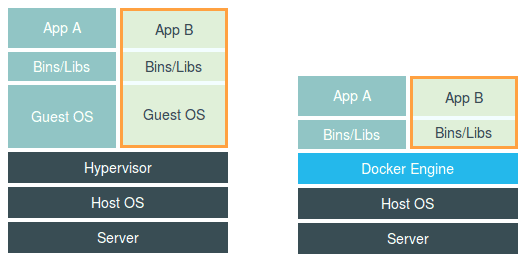

## Docker

一个“容器”，实际上是一个由 Linux Namespace、Linux Cgroups 和 rootfs 三种技术构建出来的进程的隔离环境。

[官方文档](https://docs.docker.com/)

### Docker是如何实现环境隔离的？

Linux 的 Namespace 机制。比如 Linux User 的 Namespace，也是使用 Namespace 来对不同的 User 进行隔离。

Docker的隔离实现机制与此类似。在创建容器进程时，指定了这个进程所需要启用的一组 Namespace 参数。这样，容器就只能“看”到当前 Namespace 所限定的资源、文件、设备、状态，或者配置。而对于宿主机以及其他不相关的程序，它就完全看不到了。

**容器是一个“单进程”模型。**由于一个容器的本质就是一个进程，用户的应用进程实际上就是容器里 PID=1 的进程，也是其他后续创建的所有进程的父进程。

**所以说，容器，其实是一种特殊的进程而已。**

注：之所以要强调 Linux 容器，是因为比如 Docker on Mac，以及 Windows Docker（Hyper-V 实现），实际上是基于虚拟化技术实现的，跟 Linux 容器原理完全不同。

### 虚拟机 VS Docker



这幅图的左边，画出了虚拟机的工作原理。其中，名为 Hypervisor 的软件是虚拟机最主要的部分。它通过硬件虚拟化功能，模拟出了运行一个操作系统需要的各种硬件，比如 CPU、内存、I/O 设备等等。然后，它在这些虚拟的硬件上安装了一个新的操作系统，即 Guest OS。

而这幅图的右边，则用一个名为 Docker Engine 的软件替换了 Hypervisor。**这副图这样画却并不严谨。**

在使用 Docker 的时候，并没有一个真正的“Docker 容器”运行在宿主机里面。Docker 项目帮助用户启动的，还是原来的应用进程，都由宿主机操作系统统一管理，只不过在创建这些进程时，Docker 为它们加上了各种各样的 Namespace 参数。**Namespace 技术实际上修改了应用进程看待整个计算机“视图”，即它的“视线”被操作系统做了限制，只能“看到”某些指定的内容**。而 Docker 项目在这里扮演的角色，更多的是旁路式的辅助和管理工作。所以，上面的原理图应该像下面这样画：


用户应用运行在虚拟机里面，它对宿主机操作系统的调用就不可避免地要经过虚拟化软件的拦截和处理，这本身又是一层性能损耗，尤其对计算资源、网络和磁盘 I/O 的损耗非常大。而相比之下，容器化后的用户应用，依然还是一个宿主机上的普通进程，使用 Namespace 作为隔离手段的容器并不需要单独的 Guest OS，这就使得容器额外的资源占用几乎可以忽略不计。

**使用 Namespace 作为隔离手段的劣势：**

隔离得不彻底。

既然容器只是运行在宿主机上的一种特殊的进程，那么多个容器之间使用的就还是同一个宿主机的操作系统内核。如果要在 Windows 宿主机上运行 Linux 容器，或者在低版本的 Linux 宿主机上运行高版本的 Linux 容器，都是行不通的。

在 Linux 内核中，有很多资源和对象是不能被 Namespace 化的，最典型的例子就是：时间。如果你的容器中的程序使用 settimeofday(2) 系统调用修改了时间，整个宿主机的时间都会被随之修改，这显然不符合用户的预期。

### Docker资源限制

借助 Linux Cgroups（Linux Control Group）限制一个进程组能够使用的资源上限，包括 CPU、内存、磁盘、网络带宽等等。

**一个正在运行的 Docker 容器，其实就是一个启用了多个 Linux Namespace 的应用进程，而这个进程能够使用的资源量，则受 Cgroups 配置的限制。**

### Docker镜像（rootfs 根文件系统）

Docker 镜像由多个“层”组成：

```dockerfile
$ docker image inspect ubuntu:latest
...
     "RootFS": {
      "Type": "layers",
      "Layers": [
        "sha256:f49017d4d5ce9c0f544c...",
        "sha256:8f2b771487e9d6354080...",
        "sha256:ccd4d61916aaa2159429...",
        "sha256:c01d74f99de40e097c73...",
        "sha256:268a067217b5fe78e000..."
      ]
    }
```

可以看到，这个 Ubuntu 镜像，实际上由五个层组成。这五个层就是五个增量 rootfs，每一层都是 Ubuntu 操作系统文件与目录的一部分；而在使用镜像时，Docker 会把这些增量**联合挂载在一个统一的挂载点上**。

那么，这五个镜像层，又是如何被联合挂载成一个完整的 Ubuntu 文件系统的呢？


#### 第一部分，只读层

它是这个容器的 rootfs 最下面的五层，对应的正是 ubuntu:latest 镜像的五层。

#### 第二部分，Init 层

它是一个以“-init”结尾的层，夹在只读层和读写层之间。

它是一个以“-init”结尾的层，夹在只读层和读写层之间。Init 层是 Docker 项目单独生成的一个内部层，专门用来存放 /etc/hosts、/etc/resolv.conf 等信息。

需要这样一层的原因是，这些文件本来属于只读的 Ubuntu 镜像的一部分，但是用户往往需要在启动容器时写入一些指定的值比如 hostname，所以就需要在可读写层对它们进行修改。

可是，这些修改往往只对当前的容器有效，我们并不希望执行 docker commit 时，把这些信息连同可读写层一起提交掉。

所以，Docker 做法是，在修改了这些文件之后，以一个单独的层挂载了出来。而用户执行 docker commit 只会提交可读写层，所以是不包含这些内容的。

#### 第三部分，可读写层

它是这个容器的 rootfs 最上面的一层。在没有写入文件之前，这个目录是空的。而一旦在容器里做了写操作，你修改产生的内容就会以增量的方式出现在这个层中。

如果我现在要做的，是删除只读层里的一个文件呢？

为了实现这样的删除操作，AuFS 会在可读写层创建一个 whiteout 文件，把只读层里的文件“遮挡”起来。

比如，你要删除只读层里一个名叫 foo 的文件，那么这个删除操作实际上是在可读写层创建了一个名叫.wh.foo 的文件。这样，当这两个层被联合挂载之后，foo 文件就会被.wh.foo 文件“遮挡”起来，“消失”了。这个功能，就是“ro+wh”的挂载方式，即只读 +whiteout 的含义。我喜欢把 whiteout 形象地翻译为：“白障”。

所以，最上面这个可读写层的作用，就是专门用来存放你修改 rootfs 后产生的增量，无论是增、删、改，都发生在这里。而当我们使用完了这个被修改过的容器之后，还可以使用 docker commit 和 push 指令，保存这个被修改过的可读写层，并上传到 Docker Hub 上，供其他人使用；而与此同时，原先的只读层里的内容则不会有任何变化。这，就是增量 rootfs 的好处。

**Dockerfile 中的每个原语执行后，都会生成一个对应的镜像层**。

### Docker使用小技巧

使用[阿里云加速镜像](https://cr.console.aliyun.com/cn-hangzhou/instances/mirrors)可大大提高拉取官方镜像的速度

