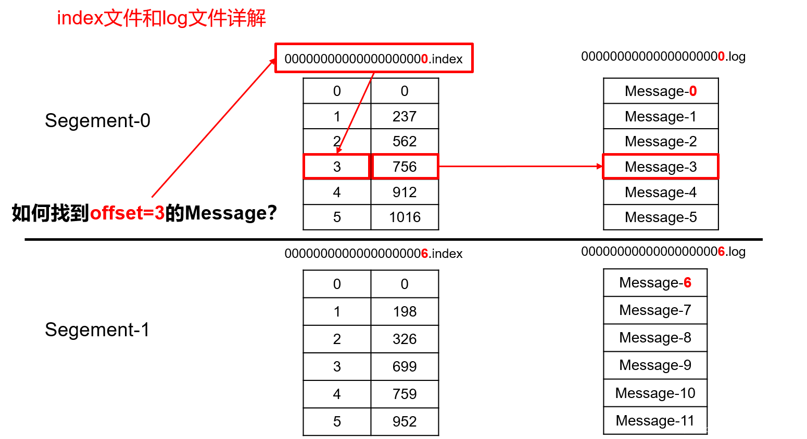
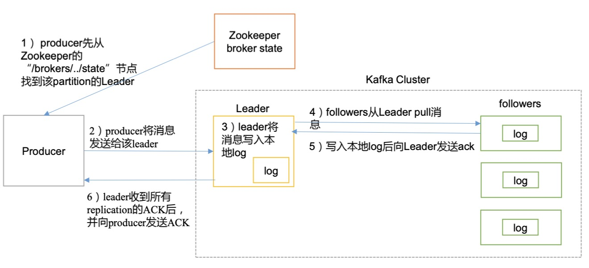
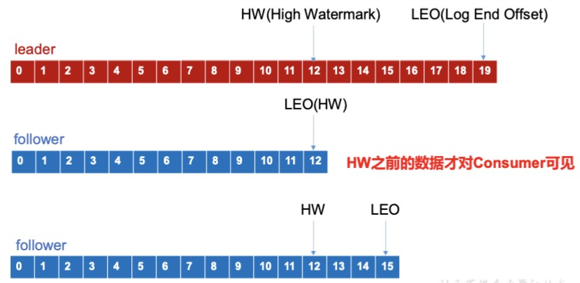
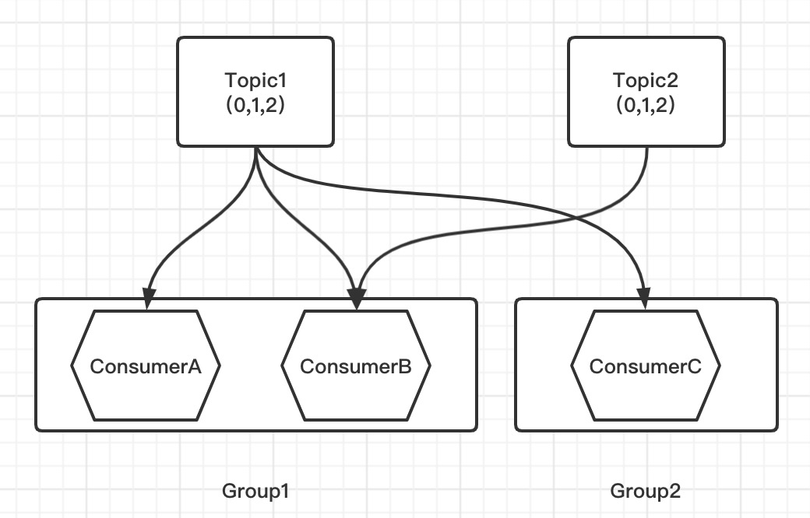

## Kafka

Kafka是一个分布式的基于发布/订阅模式的消息队列(Message Queue)

### Kafka与ZooKeeper

ZooKeeper给Kafka提供组成集群的功能，Kafka集群中有一个Broker会被选举为Controller，负责管理集群Broker的上下线，所有Topic的分区副本分配和Leader选举等工作，Controller的管理工作都是依赖于ZooKeeper的。

ZooKeeper还用于存储一些信息，比如帮助kafka的消费者存储消费到的位置信息offset（kafka v0.9之后，offset又存到kafka了，存在__consumer_offsets这个内置Topic，这样可以减小与ZooKeeper的交互频率）。

### 集群搭建

在配置文件中配置好数据目录`log.dirs`，依赖的zk集群`zookeeper.connect`，再配好唯一的`broker.id`

逐个启动就可以了`./bin/zookeeper-server-start.sh ./config/zookeeper.properties`

### Kafka性能为什么这么高？

* 分布式，分区，可以并发读写
* 顺序写磁盘
  Kafka的producer生产数据，要写入到log文件中，写的过程是一直追加到文件末端，顺序写。顺序写之所以快，是因为省去了大量磁头寻址的时间。
* 零复制技术

### Broker

Broker是Kafka集群中单个Kafka服务实例，Kafka集群由多个Broker共同组成集群。

### 主题（Topic）与分区（Partition）

消息发送时都被发送到某个 Topic，Topic的本质就是一个目录，而 topic 是由一些 Partition Logs(分区日志, 也即Kafka的消息数据)组成。

每个Partition中的消息都是有序的，生产的消息被不断追加到相应的 Partition Logs，其中的每一个消息都被赋予了一个唯一的 offset 值。

#### 消息存储方式

Broker在物理上把 Topic 分成一个或多个 Partition（对应 server.properties 中的 num.partitions=3 配置），以轮询Topic下的多个Partition的方式来均匀存储数据，每个 Partition 在物理上对应一个文件夹（该文件夹存储该 Patition 的所有消息和索引文件）。

无论消息是否被消费，Kafka 都会保留所有消息。有两种策略可以删除旧数据：

* 基于时间：log.retention.hours=168
* 基于大小：log.retention.bytes=1073741824

需要注意的是，因为 Kafka 读取特定消息的时间复杂度为 O(1)，即与文件大小无关，所以这里删除过期文件与提高 Kafka 性能无关。

#### 文件存储

由于生产者生产的消息会不断追加到`log`文件末尾，为防止`log`文件过大导致数据定位效率低下，Kafka采取了**分片**和**索引**机制，将每个Partition的数据分为多个`segment`（单个日志文件最大为`log.segment.bytes=1073741824`，超过1GB就会再生成1个新的segment日志文件），每个`segment`对应2个文件，`.index`和`.log`。这些文件位于一个文件夹下，该文件夹的命名规则为：topic 名称+分区序号。例如，first 这个 topic 有三个分区，则其对应的文件夹为  first- 0,first-1,first-2。index 和  log 文件以当前  segment 的第一条消息的  offset 命名，一个文件夹下的文件类似于这样：

00000000000000000000.index 
00000000000000000000.log 
00000000000000170410.index 
00000000000000170410.log 
00000000000000239430.index 
00000000000000239430.log

#### kafka是如何根据offset查找到对应的消息数据的？

1. 先找到 offset=3 的 message 所在的 segment文件（利用二分法查找）。

2. 对找到的 segment 中的.index文件，用查找的offset 减去.index文件名的offset，也就是00000.index文件，我们要查找的offset为3的message在该.index文件内的索引为3；index数据的存储类似于数组，每条索引都固定占用1024字节，这样就可以在.index文件中直接seek到目标索引数据。

3.  根据找到的相对offset为3的索引，确定message存储的物理偏移地址为756（假设查找到的数据长度为1000）。

4.  根据物理偏移地址和数据长度，去.log文件即可直接seek到相应的Message。

#### 分区的作用

一个Topic的数据可以存放在多个Broker，一个Broker上可以存放多个Partition。这样，producer可以将数据发送给多个Broker上的多个Partition，consumer也可以并行从多个Broker上的多个Partition上读数据。实现了水平扩展，提高了并发能力。

#### 生产者对消息数据分区存储的策略

1. 指定了 Partition，则直接使用；
2. 未指定 Partition 但指定 key，通过对 key 的 value 进行 hash 出一个 Partition；
3. Partition 和 key 都未指定，使用轮询选出一个 Partition。

#### 副本（Replication）

在集群中Topic是有多个分区（Partition）的，多个Partition组成的整体也有Leader和Follower，只能连Leader生产和消费，Follower仅提供备份作用。

副本是对应于Partition的数据。副本数不是备份数。若设置为1，实际上只有1份数据；若设置为2，则有1份备份数据（Follower存在于该Topic的Leader以外的某一台机器上，该Leader宕机时将发挥作用）。

### 生产者

1. producer 先从 zookeeper 的 "/brokers/.../state"节点找到该 partition 的 leader
2. producer 将消息发送给该 leader
3. leader 将消息写入本地 log
4. followers 从 leader pull 消息，写入本地 log 后向 leader 发送 ACK
5. leader 收到所有 [ISR](#isr) 中的 replication 的 ACK 后，增加 HW（high watermark，最后 commit 
的 offset）并向 producer 发送 ACK

#### 数据可靠性保证

为保证producer发送的数据，能可靠的发送到指定的topic，topic的每个Partition收到producer发送的数据后，都需要向producer发送**ACK**(acknowledgement确认收到)，如果producer没收到ACK，则Leader重新发送数据。

#### 数据同步策略

kafka集群的数据同步策略没有选用半数机制。

Leader维护了一个动态的 in-sync-replica set（**ISR**），意为和Leader保持同步的Follower集合（动态选出优质的Follower）。当ISR中的Follower完成数据同步之后，就会给Leader发送ACK，如果Follower长时间未向Leader同步数据，则该Follower将被踢出ISR，该时间阈值由`replica.lag.time.max.ms`参数设定。Leader发生故障之后，就会从ISR中选举新的Leader。

#### ACK应答机制

对于某些不太重要的数据，对数据的可靠性要求不是很高，能够容忍数据的少量丢失，就没必要等ISR中的Follower全部接收成功，所以kafka为用户提供了三种可靠性级别，**acks**参数配置：

| acks  |  语义  | 含义                                                         |
| -- | --- | -------------------------------------------------------- |
| 0       | At Most Once | producer不等待broker的ACK 延迟最低，可能**丢失数据**      |
| 1       |  | producer等待broker的ACK Partition的Leader落盘成功后返回ACK 如果在Follower同步成功之前Leader发生故障，也会**丢失数据** |
| -1(all) | At Least Once | producer等待broker的ACK Partition的Leader和ISR中的全部Follower落盘成功后才返回ACK 如果在Follower同步完成后，broker发送ACK之前，Leader发生故障，则会**数据重复** |

#### 数据一致性

有broker发生故障时可能会导致节点之间数据一致性问题

**LEO**（Log End Offset）: 该副本最大的offset

**HW**（High Watermark）: 所有副本中最小的LEO

* Follower故障：该Follower会被临时踢出  ISR，待该  Follower 恢复后，Follower 会读取本地磁盘 
  记录的上次的 HW，并将 log 文件高于 HW 的部分截取掉，从 HW 开始向 Leader 进行同步。 
  等该 Follower 的 LEO 大于等于该 Partition 的  HW，即   Follower 追上  Leader 之后，就可以重 新加入 ISR 了。
* Leader故障：Leader 发生故障之后，会从  ISR 中选出一个新的  Leader，之后，为保证多个副本之间的数据一致性，其余的 Follower 会先将各自的 log 文件高于 HW 的部分截掉，然后从新的  Leader 同步数据。

注：**HW**机制保证的是副本之间的数据一致性，数据的重复和丢失问题由**ACK**保证

#### 精准一次性（Exactly Once）

At Least Once + 幂等性   = Exactly Once

要启用幂等性，只需要将 Producer 的参数中`enable.idempotence`设置为 true 即可。

开启幂等性的 Producer 在 初始化的时候会被分配一个 PID（Producer ID），发往同一 Partition 的消息会附带 Sequence Number。而 Broker 端会对<PID, Partition, SeqNumber>做缓存，当具有相同主键的消息提交时，Broker 只会持久化一条。

但是 PID 重启就会变化，所以幂等性无法保证跨分区跨会话的 Exactly Once。跨分区跨会话的 Exactly Once 见下文[Kafka事务](#transaction)。

### 消费者

#### Kafka的消费模式

基于消费者主动拉取的模式

优点：消费者可以自己来控制消费速率(如果是生产者推送模式，则是由生产者控制速率，则有可能出现推送速率过高，消费者消费能力不足，从而产生异常)。

缺点：不管有没有消息，消费者都会对服务器进行长轮询，当没有新消息时，这种轮询就浪费了服务器资源。

##### 对基本的消费者主动拉取模式的优化

针对于以上方案的长轮询缺点，采用服务端主动推送和客户端拉取相结合的方案，即：由服务端主动向客户端推送新消息到来的通知，然后由客户端收到通知后自己主动拉取实际数据。这个方案也有缺点：当客户端宕机，服务端也就通知不到它了。

#### 消费者与分区

同一个分区下的某个topic是不能被同一个消费者组里的多个成员同时消费的，即某个topic的一个分区只能被同一个消费者组里的某一个成员消费。

当消费者组的成员数大于分区数时，就是资源浪费；当消费者组的成员数等于分区数时，即是最大消费能力的配置。

#### 消费者分区分配策略

一个consumer group中有多个consumer，一个topic有多个partition，所以必然会涉及到partition的分配问题，即确定哪个partition由哪个consumer来消费。消费者组的成员有增加删除的时候会触发策略重新分配。

* RoundRobin: 按消费者组所涉及的全部Partition，视为一个整体（无视Topic来划分），轮询分配。
  优点: 比较均匀的分配。
  缺点: 要保证该消费者组里面的所有消费者订阅的topic必须是一样的。
  
* Range: 逐个Topic分配Partition，同一个Topic按Partition序号的范围尽量均匀分配（若不能整除，就给消费者组里排在前面的消费者多分1个Partition）。
  优点: 消费者组里面的消费者可以订阅不同的主题。
  缺点: 分配不均匀。

案例：假设有Topic1和Topic2，分别都有3个对应的Partition（0，1，2），消费者A、B在同一个消费者组，消费者C在单独的消费者组，A订阅了Topic1，B订阅了Topic1和Topic2，C订阅了Topic1。

* 若选用了RoundRobin，Group1的分配中，会把Topic1和Topic2总共6个Partition作为整体轮询分配给A和B，这样就会导致A也消费了Topic2，显然与期望不符。
* 若选用了Range，先考虑Topic1的分配，Group2只有1个成员，Partition（0，1，2）都分配给C，在Group1中，Partition（0，1）分配给A，Partition（2）分配给B；再考虑Topic2的分配，由于Group1中只有B订阅了它，所以Topic2的Partition（0，1，2）都分配给了B；这样分配的结果是A订阅了2个Partition，B订阅了4个Partition，分配不均匀。

#### offset的维护

由这3个关键字段作为key：consumer group、topic、partition，value即是相应的offset值。

#### offset的提交

* 自动提交：若设置offset自动提交的延时太短，程序对于当前消息对应的任务还没执行完，offset就被提交了，那么程序在重启时，理应重新消费没执行完的任务，而此时没执行完的任务已被提交，造成**数据丢失**；若设置offset自动提交的延时太长，程序已经跑到最新的任务了，而offset跟不上，此时程序重启，则会造成**重复消费**。

* 手动提交：若某条消息对应的任务执行完，刚要提交offset时，重启程序，也会造成**重复消费**；

* 自定义存储offset：
  典型场景：从kafka消费数据出来最终要落地到MySQL时，选用MySQL作为kafka的offset自定义存储工具，这时offset的操作可与业务代码作为整个MySQL事务来操作。
#### 拦截器（interceptor）

实现某个功能的拦截器实例，client添加这个拦截器即可。支持以多个拦截器按序作用于同一条消息形成一个拦截链(interceptor chain)。

拦截器支持4个拦截功能函数：

* configure：获取配置信息和初始化数据时调用。
* onSend：在消息被序列化以及计算分区前调用该方法。
* onAcknowlegement：在消息成功发送到 Kafka Broker 之后，或者发送失败时调用。
* close：关闭 interceptor，主要用于执行一些资源清理工作。

典型应用场景：实现一个双 interceptor 组成的拦截链。第一个 interceptor 在消息发送前将时间戳信息加到消息 value 的最前部（实现自定义的onSend()即可）；第二个 interceptor 统计成功和失败发送消息数，程序运行结束时打印出来（当然，这只是举一个例子，这个例子的2个功能用单一的interceptor实现也可以）。

注：上述第二个interceptor的功能需要实现自定义拦截器的close()，在client调用close()关闭资源时才会触发拦截器实现的close()，client不显式调用就不会触发。

#### 消费者消费消息时，怎么知道消息在哪个Partition呢？

由上文可知，消费者组按分区分配策略来消费，分配时确定了消费者消费哪些Partition。

当消费者组成员变动时，也会重新分配Partition，消费者从kafka取回该Partition相应的offset接着消费（由上文的3个关键字段确定了唯一的offset）。

### Kafka事务

kafka支持原子操作，在一个事务中的一系列操作，包括生产者生产消息和消费者提交偏移量，同时成功或者失败。

案例：假设某一个 Topic 本轮批次要发送30条数据，写入到3个Partition中，每个Partition写入10条，当前2个Partition写入成功，后面一个Partition还没写入时，producer挂掉了，当该producer重启时，把这30条数据重新发一次，由于该producer的PID发生了变化，则写入幂等性并不能生效（幂等性的key是<PID, Partition, SeqNumber>），那么就会导致数据重复了。

对于跨分区跨会话的 Exactly Once ：由客户端引入一个全局唯一的 transactionID（用户提供`transactional.id`） ，对于以上案例，即使客户端挂掉了，重启之后，重新取得的 transactionID 仍然是之前那个 transactionID。将 transactionID 与 PID 绑定保存在Broker中，若客户端挂掉了，拿transactionID去Broker取得之前保存的PID，这样重启后的PID就没有发生变化了，也就保证了幂等性，进而实现了跨分区跨会话的 Exactly Once。

