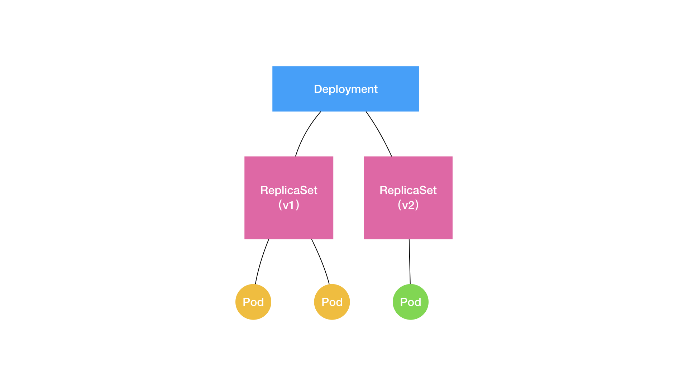

## Controller

Pod 是 Kubernetes 项目里最核心的编排对象，而编排功能则是由 Controller（kube-controller-manager） 完成。Pod 和 Controller 之间通过 label 标签建立关系。

Deployment 是控制器的一种，控制器要么就是创建、更新一些 Pod（或者其他的 API 对象、资源），要么就是删除一些已经存在的 Pod（或者其他的 API 对象、资源）。

### Deployment

控制器，是用一种对象来管理另一种对象。


控制器对象本身，负责定义被管理对象的期望状态。比如，Deployment 里的 replicas=2 这个字段。而被控制对象的定义，则来自于一个“模板”。比如，Deployment 里的 template 字段，所有被这个 Deployment 管理的 Pod 实例，都是根据这个 template 字段的内容创建出来的。



Deployment 的设计思想是应用版本和 ReplicaSet 一一对应。Deployment 实际上是一个两层控制器，Deployment 控制 ReplicaSet（版本），ReplicaSet 控制 Pod（副本数）。

Deployment 所管理的 Pod，互相之间没有顺序，也无所谓运行在哪台宿主机上。需要的时候，Deployment 就可以通过 Pod 模板创建新的 Pod；不需要的时候，Deployment 就可以“杀掉”任意一个 Pod。

Deployment 典型应用场景是：Web服务。

### StatefulSet

有状态应用， StatefulSet 可以认为是对 Deployment 的改良。

StatefulSet 这个控制器的主要作用之一，就是使用 Pod 模板创建 Pod 的时候，对它们进行编号，编号与 Pod 的名字和 hostname 等标识信息绑定上，并且按照编号顺序逐一完成创建工作。当需要新建或者删除 Pod 进行“调谐”的时候，它会严格按照这些 Pod 编号的顺序，逐一完成这些操作。

#### Service 是如何被访问的?

**第一种方式，是以 Service 的 VIP（Virtual IP，即：虚拟 IP）方式**。比如：当我访问 10.0.23.1 这个 Service 的 IP 地址时，10.0.23.1 其实就是一个 VIP，它会把请求转发到该 Service 所代理的某一个 Pod 上。

**第二种方式，就是以 Service 的 DNS 方式**。比如：这时候，只要我访问“my-svc.my-namespace.svc.cluster.local”这条 DNS 记录，就可以访问到名叫 my-svc 的 Service 所代理的某一个 Pod。

在第二种 Service DNS 的方式下，具体还可以分为两种处理方法：

第一种处理方法，是 Normal Service。这种情况下，你访问“my-svc.my-namespace.svc.cluster.local”解析到的，正是 my-svc 这个 Service 的 VIP，后面的流程就跟 VIP 方式一致了。

第二种处理方法，是 **Headless Service**。这种情况下，访问“my-svc.my-namespace.svc.cluster.local”解析到的，直接就是 my-svc 代理的某一个 Pod 的 IP 地址。

这样的设计有什么作用呢？

#### 拓扑状态的维持

因为`<pod-name>.<svc-name>.<namespace>.svc.cluster.local`这样的DNS 记录，是 Kubernetes 项目为 Pod 分配的唯一的“可解析身份”（Resolvable Identity）。

Pod每次重建，它的IP都会发生变化，如果通过IP来定位Pod，拓扑状态就不稳定了。

应用的多个实例分别绑定了不同的存储数据，一对一绑定，即使 Pod 被重新创建，也会按照之前的编号顺序和绑定关系重新创建出新的 Pod，虽然新的 Pod 的集群ip发生了变化，由于这些 Pod 名字里的编号不变，那么 Service 里类似于 web-0.nginx.default.svc.cluster.local 这样的 DNS 记录也就不会变，网络标识和数据的绑定关系与之前都是相同的。

#### 例子

```yaml
apiVersion: v1
kind: Service
metadata:
  name: nginx
  labels:
    app: nginx
spec:
  ports:
  - port: 80
    name: web
  clusterIP: None
  selector:
    app: nginx
```

clusterIP 字段的值为`None`的就是 Headless Service。这个 Service 被创建后并不会被分配一个 VIP，而是会以 DNS 记录的方式暴露出它所代理的 Pod。也是用 Label Selector 机制选择出来的，所有携带了 app=nginx 标签的 Pod，都会被这个 Service 代理起来。创建的 Headless Service 会使它所代理的所有 Pod 的 IP 地址再绑定一个这样格式的 DNS 记录`<pod-name>.<svc-name>.<namespace>.svc.cluster.local`。

```yaml
apiVersion: apps/v1
kind: StatefulSet
metadata:
  name: web
spec:
  serviceName: "nginx"
  replicas: 2
  selector:
    matchLabels:
      app: nginx
  template:
    metadata:
      labels:
        app: nginx
    spec:
      containers:
      - name: nginx
        image: nginx:1.9.1
        ports:
        - containerPort: 80
          name: web
```

和 deployment 的 yaml 唯一区别，就是多了一个 serviceName=nginx 字段。这个字段的作用，就是告诉 StatefulSet 控制器，在执行控制循环（Control Loop）的时候，请使用 nginx 这个 Headless Service 来保证 Pod 的“可解析身份”。

StatefulSet 典型应用场景是：按顺序启动的主从关系，或者一个数据库应用的多个存储实例。

#### 存储状态的维持

```yaml
apiVersion: apps/v1
kind: StatefulSet
metadata:
  name: web
spec:
  serviceName: "nginx"
  replicas: 2
  selector:
    matchLabels:
      app: nginx
  template:
    metadata:
      labels:
        app: nginx
    spec:
      containers:
      - name: nginx
        image: nginx:1.9.1
        ports:
        - containerPort: 80
          name: web
        volumeMounts:
        - name: www
          mountPath: /usr/share/nginx/html
  volumeClaimTemplates:
  - metadata:
      name: www
    spec:
      accessModes:
      - ReadWriteOnce
      resources:
        requests:
          storage: 1Gi
---
kind: PersistentVolume
apiVersion: v1
metadata:
  name: pv-volume
  labels:
    type: local
spec:
  capacity:
    storage: 10Gi
  rbd:
    monitors:
    - '10.16.154.78:6789'
    - '10.16.154.82:6789'
    - '10.16.154.83:6789'
    pool: kube
    image: foo
    fsType: ext4
    readOnly: true
    user: admin
    keyring: /etc/ceph/keyring
    imageformat: "2"
    imagefeatures: "layering"
```

PVC 的定义，就来自于 volumeClaimTemplates 这个模板字段，这个 PVC 的名字，会被分配一个与这个 Pod 完全一致的编号。

自动创建的 PVC，与 PV 绑定成功后，就会进入 Bound 状态，这就意味着这个 Pod 可以挂载并使用这个 PV 了。

```bash
$ kubectl create -f statefulset.yaml
$ kubectl get pvc -l app=nginx
NAME        STATUS    VOLUME                                     CAPACITY   ACCESSMODES   AGE
www-web-0   Bound     pvc-15c268c7-b507-11e6-932f-42010a800002   1Gi        RWO           48s
www-web-1   Bound     pvc-15c79307-b507-11e6-932f-42010a800002   1Gi        RWO           48s
```

可以看到，这些 PVC，都以“<PVC 名字 >-<StatefulSet 名字 >-< 编号 >”的方式命名，并且处于 Bound 状态。

Pod 的编号与 PVC 的编号一一对应，比如，在名叫 web-0 的 Pod 的 volumes 字段，它会声明使用名叫 www-web-0 的 PVC。

如果在此时删除 web-0 这个 Pod。

当把一个 Pod 删除之后，这个 Pod 对应的 PVC 和 PV，并不会被删除，而这个 Volume 里已经写入的数据，也依然会保存在远程存储服务里。

当把一个 Pod 删除之后，StatefulSet 控制器会创建一个新的 Pod。在这个新的 Pod 对象的定义里，它声明使用的 PVC 的名字与之前相同，还是叫作：www-web-0。

所以，在这个新的 web-0 Pod 被创建出来之后，Kubernetes 为它查找名叫 www-web-0 的 PVC 时，就会直接找到旧 Pod 遗留下来的同名的 PVC，进而找到跟这个 PVC 绑定在一起的 PV。

这样，新的 Pod 就可以挂载到旧 Pod 对应的那个 Volume，并且获取到保存在 Volume 里的数据。