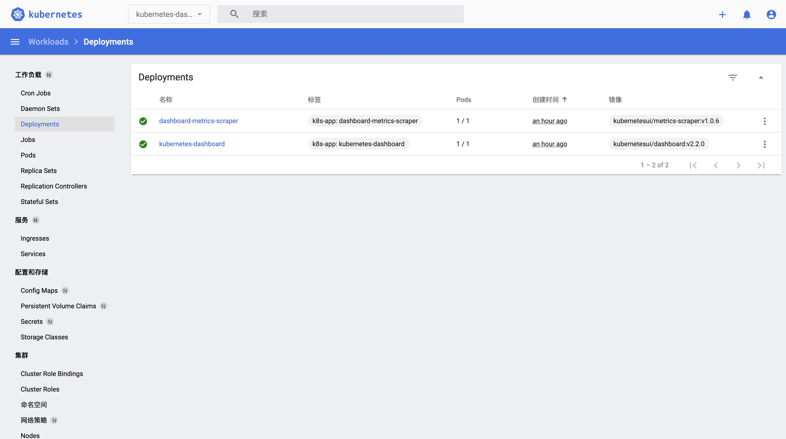

## dashboard

### 安装

```bash
kubectl apply -f https://raw.githubusercontent.com/kubernetes/dashboard/v2.2.0/aio/deploy/recommended.yaml

```

参考： <https://github.com/kubernetes/dashboard>

指定命名空间去查询安装情况：

```
kubectl get all -n kubernetes-dashboard
```

### 配置证书

```
grep 'client-certificate-data' ~/.kube/config | head -n 1 | awk '{print $2}' | base64 -d >> kubecfg.crt
```

```
grep 'client-key-data' ~/.kube/config | head -n 1 | awk '{print $2}' | base64 -d >> kubecfg.key
```

```
openssl pkcs12 -export -clcerts -inkey kubecfg.key -in kubecfg.crt -out kubecfg.p12 -name "kubernetes-client"
```

输入配置证书的密码

我是Mac电脑，双击生成的p12证书，导入到钥匙链

### 配置admin用户

```bash
cat <<EOF | kubectl apply -f -
apiVersion: v1
kind: ServiceAccount
metadata:
  name: admin-user
  namespace: kubernetes-dashboard
EOF
```

```bash
cat <<EOF | kubectl apply -f -
apiVersion: rbac.authorization.k8s.io/v1
kind: ClusterRoleBinding
metadata:
  name: admin-user
roleRef:
  apiGroup: rbac.authorization.k8s.io
  kind: ClusterRole
  name: cluster-admin
subjects:
- kind: ServiceAccount
  name: admin-user
  namespace: kubernetes-dashboard
EOF
```

```bash
kubectl -n kubernetes-dashboard get secret $(kubectl -n kubernetes-dashboard get sa/admin-user -o jsonpath="{.secrets[0].name}") -o go-template="{{.data.token | base64decode}}"
```

这一步得到的就是`Bearer Token`

参考：<https://github.com/kubernetes/dashboard/blob/master/docs/user/access-control/creating-sample-user.md>

### 访问服务

查看集群相关信息：

```
kubectl cluster-info
```

得到：

```bash
Kubernetes control plane is running at https://kubernetes.docker.internal:6443
KubeDNS is running at https://kubernetes.docker.internal:6443/api/v1/namespaces/kube-system/services/kube-dns:dns/proxy
```

运行`dashboard`服务：

```
kubectl proxy
```

拿到集群信息当中的域名（https://kubernetes.docker.internal:6443）访问服务：

https://kubernetes.docker.internal:6443/api/v1/namespaces/kubernetes-dashboard/services/https:kubernetes-dashboard:/proxy/

输入上一步得到的`Bearer Token`即可


