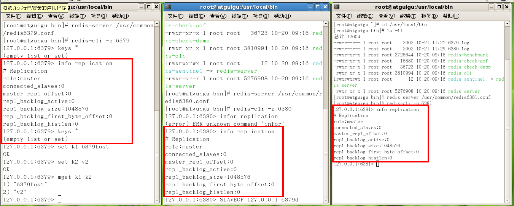

## Redis

### 主从复制

主机数据更新后根据配置和策略， 把数据自动同步到备机的master/slaver机制，Master以写为主，Slave以读为主。

#### 准备工作

- 配从(库)不配主(库)

- 从库配置命令：

  ```bash
  slaveof 主库IP 主库端口
  ```

  - 每次与master断开之后，都需要重新连接，除非你配置进redis.conf文件（具体位置：redis.conf搜寻`#### REPLICATION ####`）
  - `info replication`可查看当前连接的redis服务器在集群中的信息

- 修改配置文件细节操作

  - 拷贝多个redis.conf文件，按`redis[port].conf`重命名
  - 开启daemonize yes
  - pidfile 修改（与端口相关）
  - 指定端口
  - logfile文件名字修改（与端口相关）
  - dbfilename 名字修改（与端口相关）

#### 一主二仆

- Init 



- 一个Master两个Slave 


- 主机日志查看


- 备机日志 


- `info replication` 


- 主从问题
  1. 切入点问题？slave1、slave2是从头开始复制还是从切入点开始复制?比如从k4进来，那之前的123是否也可以复制？
     - 答：从头开始复制；123也可以复制
  2. 从机是否可以写？set可否？
     - 答：从机不可写，不可set，主机可写
  3. 主机shutdown后情况如何？从机是上位还是原地待命
     - 答：从机原地待命!
  4. 主机又回来了后，主机新增记录，从机还能否顺利复制？
     - 答：能
  5. 其中一台从机down后情况如何？依照原有它能跟上大部队吗？
     - 答：不能跟上，每次与master断开之后，都需要重新连接，除非你配置进redis.conf文件（具体位置：redis.conf搜寻`#### REPLICATION ####`）

#### 薪火相传

- 上一个Slave可以是下一个slave的Master，Slave同样可以接收其他 slaves的连接和同步请求，那么该slave作为了链条中下一个的master, 可以有效减轻master的写压力（奴隶的奴隶还是奴隶）
- 中途变更转向：会清除之前的数据，重新建立拷贝最新的
- `slaveof 新主库IP 新主库端口`

#### 反客为主

在从机上执行如下命令，使当前数据库停止与其他数据库的同步，转成主数据库

```bash
SLAVEOF no one
```

#### 复制原理

- slave启动成功连接到master后会发送一个sync命令
- master接到命令启动后台的存盘进程，同时收集所有接收到的用于修改数据集命令， 在后台进程执行完毕之后，master将传送整个数据文件到slave,以完成一次完全同步
- 全量复制：而slave服务在接收到数据库文件数据后，将其存盘并加载到内存中。
- 增量复制：Master继续将新的所有收集到的修改命令依次传给slave,完成同步
- 但是只要是重新连接master，一次完全同步（全量复制)将被自动执行

### 哨兵模式(sentinel)

一组sentinel能同时监控多个master，sentinel就是反客为主的自动版，能够后台监控主机是否故障，如果故障了根据投票数自动将从库转换为主库。

#### 操作步骤

1. 调整结构，6379带着6380、6381
2. 新建sentinel.conf文件，名字绝不能错
3. 配置哨兵,填写内容
   1. `sentinel monitor 被监控数据库名字(自己起名字) 127.0.0.1 6379 1`
   2. 上面最后一个数字1，表示主机挂掉后salve投票看让谁接替成为主机，得票数多少后成为主机（PS. 跟官网的描述有出入，下面有官方文档说明）
4. 启动哨兵`redis-sentinel /sentinel.conf `


#### 如果之前挂了的master重启回来，会不会双master冲突？ 

 不会，原master，变成slave。

#### 哨兵模式的选举

1. 较低的slave_priority（这个是在配置文件中指定，默认配置为100）
2. 较大的replication offset（每个slave在与master同步后offset自动增加）
3. 较小的runid（每个redis实例，都会有一个runid,通常是一个40位的随机字符串,在redis启动时设置，重复概率非常小）
4. 如果以上条件都不足以区别出唯一的节点，则会看哪个slave节点处理之前master发送的command多，就选谁。

### 集群模式和哨兵模式的区别

1. 哨兵模式监控权交给了哨兵系统，集群模式中是工作节点自己做监控
2. 哨兵模式发起选举是选举一个leader哨兵节点来处理故障转移，集群模式是在从节点中选举一个新的主节点，来处理故障的转移

[Redis 深度历险：核心原理与应用实践](https://juejin.im/book/5afc2e5f6fb9a07a9b362527/section)