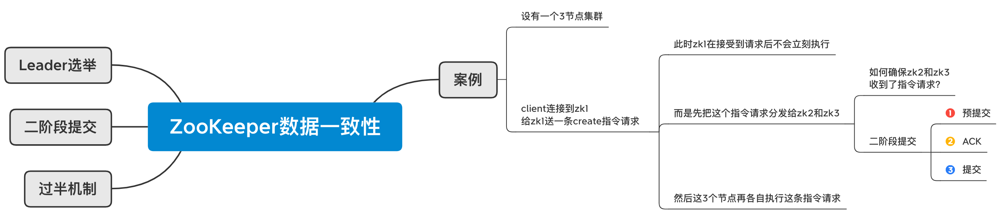
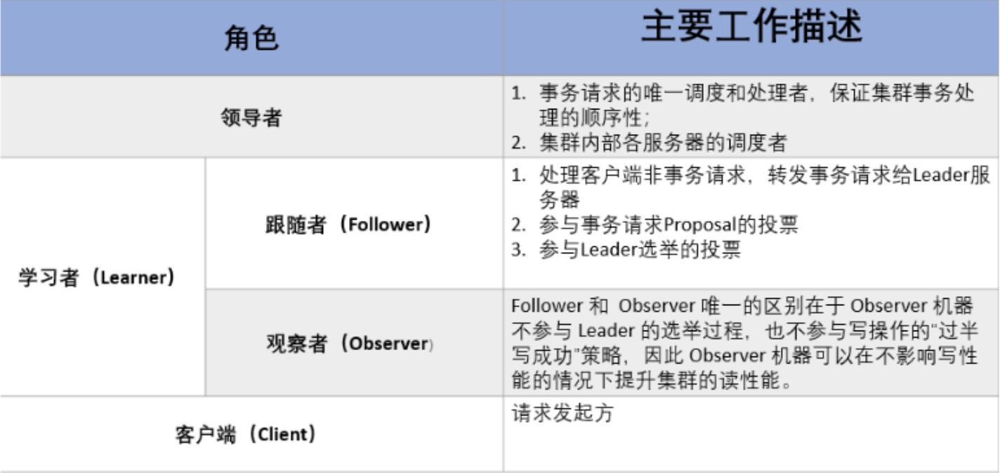

## ZooKeeper

ZooKeeper是一个分布式的协调服务，为分布式应用提供一致性服务的软件。ZooKeeper需要配置多个实例共同构成一个集群对外提供服务以达到水平扩展的目的，每个服务器上的数据是相同的，每一个服务器均可以对外提供读和写的服务（但实际上只有Leader可以写，见下文），这点和redis是相同的，即对客户端来讲每个服务器都是平等的。

### ZooKeeper如何保证数据一致性？

对于多节点之间的数据同步，以 Leader 的数据为准，所以涉及到了 Leader选举算法。

二阶段提交：由 Leader 发起指令“预约”，Follower 收到指令请求后发回 ACK，表示收到了，然后各节点各自提交执行指令（zk对Leader接收到的指令进行同步，而kafka和MySQL是对Leader的数据进行同步）。

过半机制：Leader 不需要等所有 Follower 返回 ACK，超过一半 Follower 返回了 ACK，就代表指令成功提交了。

### ZooKeeper的Leader选举机制？

ZooKeeper的节点有Leader、Follower、Observer三种。

- 过半机制：集群中半数以上的节点存活，ZooKeeper服务就可以正常使用。所以Zookeeper适合安装奇数台的服务器，最少是3台。竞选过程中得票超过半数时竞选成功成为Leader。
- ID编号：服务器ID编号越大，在选举算法中的权重越大；服务器中存放数据的ID号越大，说明数据越新，该台服务器的选举权重就越大。

服务器的选举状态

- LOOKING，竞选状态。
- FOLLOWING，随从状态，同步leader状态，参与投票。
- OBSERVING，观察状态，同步leader状态，不参与投票。
- LEADING，领导者状态。

假设目前有5台服务器，它们的编号分别是1,2,3,4,5,按编号依次启动，它们的选择举过程如下：

1. 服务器1启动，给自己投票，然后发投票信息，由于其它机器还没有启动所以它收不到反馈信息，服务器1的状态一直属于LOOKING。
2. 服务器2启动，给自己投票，同时与之前启动的服务器1交换结果，由于服务器2的编号大所以服务器2胜出，服务器1也把票投给服务器2，但此时投票数没有大于半数，所以两个服务器的状态依然是LOOKING。
3. 服务器3启动，给自己投票，同时与之前启动的服务器1,2交换信息，由于服务器3的编号最大所以服务器3胜出，服务器1,2把票也投给服务器3，此时投票数正好大于半数，所以服务器3成为Leader，服务器1,2成为Follower。
4. 服务器4启动，给自己投票，同时与之前启动的服务器1,2,3交换信息，尽管服务器4的编号大，但之前服务器3已经胜出，所以服务器4只能成为Follower。
5. 服务器5启动，后面的逻辑同服务器4成为Follower。

### ZooKeeper监听器原理？

监听，即是观察者模式的一种具体实现。

1. ZooKeeper客户端会创建两个线程，一个负责网络连接通信(**connet**)，一个负责监听(**listener**)。

2. ZooKeeper客户端通过(**connet**)线程将注册监听事件发送给ZooKeeper服务器。

3. ZooKeeper服务器有一个注册监听列表，将注册的监听事件添加到列表中。

4. ZooKeeper服务器监听到数据有变化，就会将这个消息发送给监听列表中的客户端的**listener**线程

5. 客户端的**listener**线程触发`Process()`回调方法。

### ZooKeeper的节点类型

* PERSISTENT                                 持久化节点

* PERSISTENT_SEQUENTIAL         持久化顺序节点

* EPHEMERAL                                 临时节点

* EPHEMERAL_SEQUENTIAL          临时顺序节点

注：2种临时节点类型，客户端掉线后就会删除该节点；2种顺序节点类型，会给提交的节点名加上zk维护自增的编号。