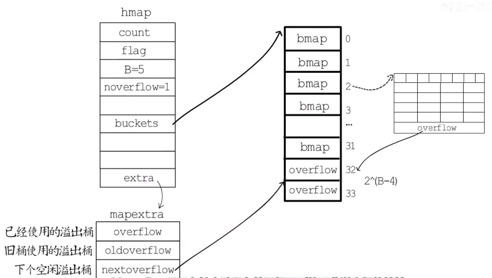

## 哈希

哈希表基于数组实现，数组的每一个成员（在这里也称为"桶"）用来存储键值对

先通过散列均匀的哈希函数把`key`处理一下，得到一个哈希值

再利用这个哈希值在m个桶中选择一个（数组 [0, m-1] ）

当 m = 2 的n次幂时，`hash % m = hash & (m - 1)`，且与运算具有较高的效率，因此Go语言的`map`采用**与运算**来选择桶`hash & (m-1) `

如果多个`key`选择了同一个桶，就是发生了哈希冲突，Go 语言使用**拉链法**来解决哈希冲突的问题

拉链法就是将桶中所有关键字存储在同一线性链表，在查找时，就拿到这个链表的节点来比对`key`的值，若不相同就顺着链表往后查找

哈希冲突的发生会影响哈希表的读写效率，选择散列均匀的哈希函数可以减少哈希冲突的发生，适时对哈希表进行扩容也是保障读写效率的有效手段

通常会把存储的键值对数量与桶的数量的比值（**装载因子**是否大于6.5）作为是否需要扩容的判断依据

扩容时需要把旧桶里存储的键值对全都迁移到新桶，如果哈希表存储的键值对较多，那么一次迁移就需要较多的时间消耗，所以通常会在哈希表扩容时，先分配足够多的新桶，记录好新桶的位置（buckets），然后记录好旧桶的位置(oldbuckets)，再用一个字段记录旧桶迁移的进度（nevacuate记录下一个要迁移的旧桶编号）

在哈希表每次读写操作时，如果检测到当前处于扩容阶段，就完成一部分键值对迁移任务，直到所有旧桶迁移完成

对于新的写入操作会进行分流处理（取决于该桶是否搬迁完成，源码中的`evacuated`函数判断）

读取操作也会分流，先根据`key`的hash值用与运算算出`bucket`的编号，根据标志位判断如果正在扩容，再用与运算算一下该`key`的hash值对应在`oldbucket`的编号，调用`evacuated`函数判断是否搬迁完成，若没有搬迁完成就定位到`oldbucket`对应编号去找，[参考](https://zhuanlan.zhihu.com/p/66676224)

像这样把键值对迁移的时间分摊到多次哈希表操作中的方式就是**渐进式扩容**，可以避免一次性扩容带来的性能瞬时抖动

```go
type hmap struct {
	count     int							// 键值对数量
	flags     uint8						// 比如标记为正在扩容
	B         uint8						// 桶的数量是2^B（选择桶采用的是与运算的方法）
	noverflow uint16					// 记录使用的溢出桶数量
	hash0     uint32

	buckets    unsafe.Pointer	// 桶数组的指针
	oldbuckets unsafe.Pointer	// 渐进式扩容时的旧桶数组指针
	nevacuate  uintptr				// 渐进式扩容时下一个要迁移的旧桶编号

	extra *mapextra						// mapextra 结构体记录的是溢出桶相关的信息
}
// 桶
type bmap struct {
    tophash [bucketCnt]uint8
}
// 编译期间的桶的新的结构
type bmap struct {
    topbits  [8]uint8
    keys     [8]keytype  // 一个桶最多存8个键值对
    values   [8]valuetype
    pad      uintptr
    overflow uintptr		// 指针，指向溢出桶，该桶存储的键值对超过8个键值对时使用，可以减少扩容次数
}
// 溢出桶
type mapextra struct {
	overflow    *[]*bmap  // 记录目前已经被使用的溢出桶的地址
	oldoverflow *[]*bmap	// 在扩容阶段存储旧桶用到的那些溢出桶的地址
	nextOverflow *bmap		// nextoverflow 指向下一个空闲溢出桶
}
```

如下图，常规桶和溢出桶在内存中是连续的，假设预分配了2个溢出桶，假设编号为2的常规桶装满了8个键值对，就会在其后链一个溢出桶，该`bmap`的`overflow`指向内存中的第一个溢出桶，`hmap`的`mapextra`中的`nextoverflow`就指向了内存中的第二个溢出桶的地址，此时，只使用了1个溢出桶，`hmap`的`noverflow=1`。



* 哈希在每一个桶(链表)中存储键对应哈希的前 8 位，当对哈希进行操作时，这些 `tophash` 就成为了一级缓存帮助哈希快速遍历桶中元素
* 每一个桶都只能存储 8 个键值对，一旦当前哈希的某个桶超出 8 个，新的键值对就会被存储到哈希的溢出桶中
* 随着键值对数量的增加，溢出桶的数量和哈希的装载因子也会逐渐升高，超过一定范围就会触发扩容
* 扩容会将桶的数量翻倍，元素再分配的过程也是在调用写操作时增量进行的，不会造成性能的瞬时巨大抖动

map的Go语言实现细节优化点很复杂, [参考](https://draveness.me/golang/docs/part2-foundation/ch03-datastructure/golang-hashmap/)

### 线程安全问题

Go语言中内置的map不是并发安全的，并发写会panic：`fatal error: concurrent map writes`。
可以使用`sync.Map`来解决map的并发安全问题，`sync.Map`不需要调用`make`来初始化：

```go
var m = sync.Map{}
m.Store(key, n)	// set
value, _ := m.Load(key) // get
```

### sync.Map的原理

```go
type Map struct {
    // 加锁作用，保护 dirty 字段
    mu Mutex
    // 只读的数据，实际数据类型为 readOnly
    read atomic.Value
    // 最新写入的数据
    dirty map[interface{}]*entry
    // 计数器，每次需要读 dirty 则 +1
    misses int
}
type readOnly struct {
    // 内建 map
    m  map[interface{}]*entry
    // 表示 dirty 里存在 read 里没有的 key，通过该字段决定是否加锁读 dirty
    amended bool
}
type entry struct {
    p unsafe.Pointer  // 等同于 *interface{}
}
```

`sync.Map`在读和删除两项性能大幅领先使用`sync.Mutex`或`RWMutex`包装的原生map。

sync.Map是如何实现如此高的读取性能的呢？简单说：空间换时间+读写分离+原子操作(快路径)。

read(这个map)好比整个sync.Map的一个**“高速缓存”**，当goroutine从sync.Map中读取数据时，sync.Map会首先查看read这个缓存层是否有用户需要的数据(key是否命中)，如果有(命中)，则通过原子操作将数据读取并返回，这是sync.Map推荐的**快路径(fast path)**，也是为何它读操作性能高的原因，[参考](https://tonybai.com/2020/11/10/understand-sync-map-inside-through-examples/)。

#### 写入数据

新写入的数据存储在dirty的map中

read中的**amended**值由false变为了true，**表示dirty map中存在某些read map还没有的key**。

#### dirty提升(promoted)为read

当Load方法在read map中没有命中（miss)传入的key时，该方法会再次尝试在dirty中继续匹配key；

无论是否匹配到，Load方法都会在锁保护下调用missLocked方法增加misses的计数(+1)；如果增加完计数的misses值大于等于dirty map中的元素个数，则会将dirty中的元素整体提升到read

promoted(dirty -> read)是一个整体的指针原子交换操作，promoted时，sync.Map直接将原dirty指针store给read并将自身置为nil


