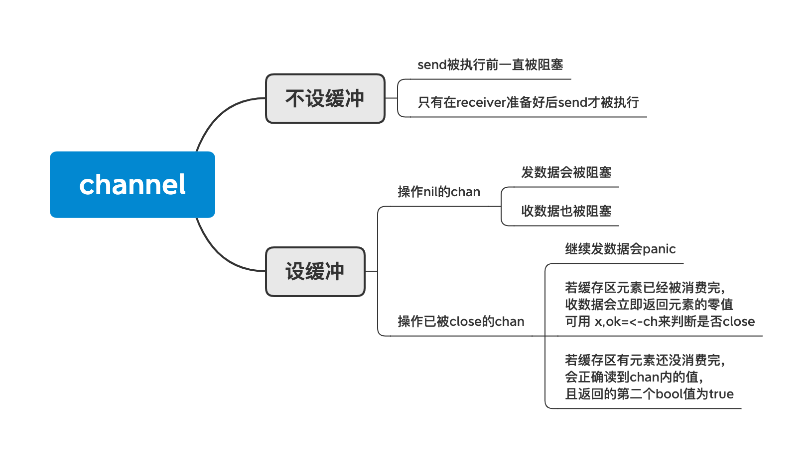

## 管道

如果说`goroutine`是Go程序并发的执行体，`channel`就是它们之间的连接。`channel`是可以让一个`goroutine`发送特定值到另一个`goroutine`的通信机制。

Go 语言中的通道（channel）是一种特殊的类型。通道像一个传送带或者队列，总是遵循先入先出（First In First Out）的规则，保证收发数据的顺序。

使用全局变量，不同的线程使用锁来处理全局变量的资源竞争，这种方式就是通过共享内存来通信，而Go语言主张：

> 使用通信来共享内存，而不是通过共享内存来通信

常见用法
*  `for select`
* `for range channel`会一直迭代到`channel`被 close



发送逻辑要点:

- 如果channel已经关闭，会抛出panic: `send on closed channel`
- 当存在等待的接收者时，会直接将数据发送给阻塞的接收者；
- 当缓冲区存在空余空间时，将发送的数据写入 Channel 的缓冲区；
- 当不存在缓冲区或者缓冲区已满时，等待其他 Goroutine 从 Channel 接收数据；

Q: 如何避免向closed channel发送消息？

A: 说明所编写的程序有设计bug。channel关闭原则:

* 不要在消费端关闭channel

* 不要在有多个并行的生产者时对channel执行关闭操作

* 应该只在[唯一的或者最后唯一剩下]的生产者协程中关闭channel，来通知消费者已经没有值可以继续读

* 只要坚持这个原则，就可以确保向一个已经关闭的channel发送数据的情况不可能发生

Q: 退出程序时, 如何防止channel没有消费完？

1. 多个消费者，一个生产者。直接让生产者关闭channel即可。

2. 多个生产者，一个消费者。由消费者通过channel发送停止生产数据的信号给生产者，生产者在生产数据的同时监听此信号channel，收到信号return即可。值得注意的是，这个例子中生产端和接受端都没有关闭消息数据的channel，channel在没有任何goroutine引用的时候会自行关闭，而不需要显示进行关闭。

3. 多个生产者，多个消费者。多个消费者成了信号channel的多个生产者（上一种情况是单一的），因此不可以在信号channel消费端（也即数据channel生产端）关闭此信号channel，这违背了关闭原则，多个消费者发送信号有先后，信号channel被关闭时，其他消费者继续发送信号将引发panic。解决方案是引入一个额外的协调者来关闭附加的退出信号channel。

   设计一个停止生产的信号和一个生产者已经停止的信号，生产者监听停止生产的信号，在return之前发送已经停止的信号，额外的协调者goroutine用于搜集生产者已经停止生产的信号，搜集完整则调用close。

Q: 生产者把消息发送完立刻调用close, 不等消费者消费完，会丢数据吗？

A: 不会丢数据。原理[参考](http://xiaorui.cc/archives/5007)

channel数据结构:

```go
type hchan struct {
	qcount   uint
	dataqsiz uint
	buf      unsafe.Pointer
	elemsize uint16
	closed   uint32
	elemtype *_type
	sendx    uint  
	recvx    uint
	recvq    waitq
	sendq    waitq

	lock mutex
}
```

* 从某种程度上说，channel 是一个用于同步和通信的有锁队列(互斥锁解决线程竞争问题)
* channel的缓冲区其实是一个环形队列
* `qcount`表示队列中元素的数量
* `dataqsiz`表示环形队列的总大小
* `buf`表示一个指向循环数组的指针
* `sendx`和`recvx`分别用来标识当前发送和接收的元素在循环队列中的位置
* `recvq`和`sendq`都是一个列表，分别用于存储当前处于等待接收和等待发送的`Goroutine`

