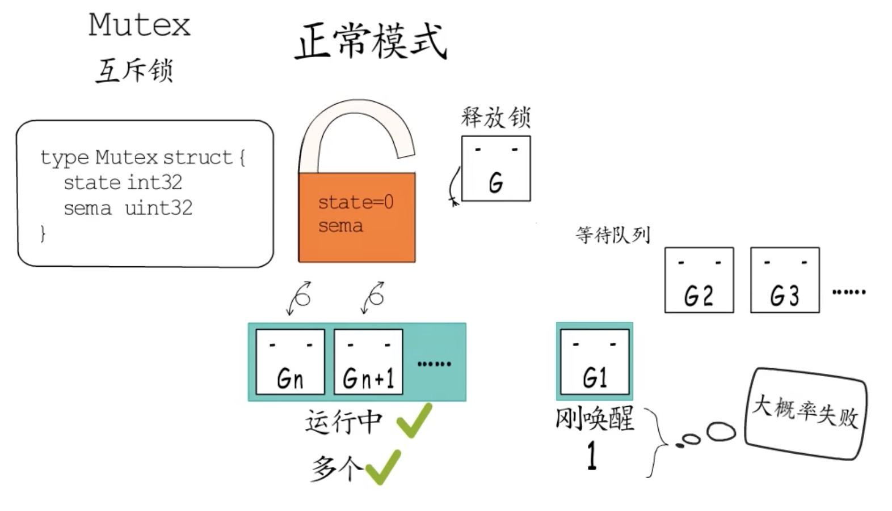
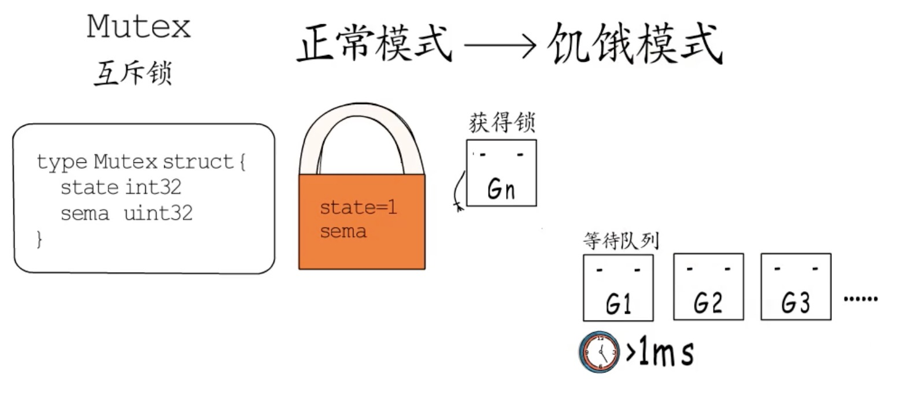

## 锁

锁能保证多个 Goroutine 在访问同一片内存时不会出现竞争条件（Race condition）等问题。

### 互斥锁 (sync.Mutex)

确保锁定的操作在同一时刻只有一个goroutine能执行。

#### 基本使用

非常简单，进入临界区之前调用 Lock 方法，退出临界区的时候调用 Unlock 方法。

#### 注意事项

* 使用基本原则：**谁申请，谁释放**
* 不要重复锁定互斥锁（重复锁定，第2次锁定会一直阻塞，自己锁死了自己）
* 不要忘记解锁互斥锁，必要时可使用`defer`语句解锁（锁定和解锁应当成对出现，对于每一个锁定操作，都要有且仅有一个对应的解锁操作）
* 不要对尚未锁定或者已解锁的互斥锁解锁（会立即引发panic，而且无法被recover，程序会立刻崩溃）
* 不要在多个函数之间直接传递互斥锁（sync.Mutex是结构体类型，属于值类型，把它传递给一个函数会导致它的副本产生，而且原值和它的副本是完全独立的，它们都是不同的互斥锁。如果把互斥锁作为参数传给一个函数，那么在这个函数中对传入的锁的所有操作，都不会对存在于该函数之外的那个原锁产生任何影响）

### 互斥锁的原理

```go
type Mutex struct {
	state int32
  sema  unit32
}
```

#### 正常模式

一个尝试加锁的goroutine会先自旋4次，尝试通过原子操作获得锁，若4次自旋后仍然没获得锁，则通过信号量排队等待，所有的等待者会按照先入先出（FIFO）的顺序排队。

但是当锁被释放，第一个等待者被唤醒后并不会直接拥有锁，而是需要和后来者竞争，也就是那些处于自旋阶段，尚未排队等待的goroutine。这种情况下，后来者更有优势，因为它们正在CPU上运行，可免去上下文切换开销，而且处于自旋状态的goroutine可以有很多，而被唤醒的goroutine每次只有一个，所以被唤醒的goroutine大概率拿不到锁。



这种情况下，它会被重新插入到等待队列的头部，而不是尾部。而当一个goroutine本次加锁等待的时间超过1ms后，它会把当前 Mutex 从正常模式切换至饥饿模式。



#### 饥饿模式

当执行 Unlock 时，Mutex 的所有权从执行 Unlock 的goroutine直接传递给等待队列头部的goroutine，新创建的goroutine不会自旋，也不会尝试获得锁，即使 Mutex 处于 Unlocked 状态。它们会直接从队列的尾部排队等待。

当一个等待者获得锁之后，会在以下两种情况将Mutex从饥饿模式切换回正常模式：

* 当该goroutine的等待时间小于 1ms
* 它是等待队列最后一个等待者

#### 总结

在正常模式下，自旋和排队是同时存在的，执行Lock的goroutine会先一边自旋，尝试4次后如果还没拿到锁，就需要去排队等待了。

这种在排队之前先让大家来抢的模式，能够有更高的吞吐量，因为频繁的挂起、唤醒goroutine会带来较多的开销。但是又不能无限制的自旋，要把自旋的开销控制在较小的范围内。所以在正常模式下，Mutex有更好的性能，但是有可能出现队列尾端的goroutine迟迟抢不到锁的情况。

而饥饿模式下，不再自旋尝试，所有goroutine都要排队，严格的先来后到，对于出现尾端延迟来讲特别重要。

### 读写互斥锁 (sync.RWMutex)

读写互斥锁在互斥锁之上提供了额外的更细粒度的控制，能够在读操作远远多于写操作时提升性能。

- 写锁: `sync.RWMutex.Lock`对应`sync.RWMutex.Unlock`
- 读锁: `sync.RWMutex.RLock`对应`sync.RWMutex.RUnlock`
- 在读锁已被锁定的情况下再试图锁定读锁，不会阻塞当前goroutine（主要就是利用读写锁消除了读操作互斥这一特性了）
- 重复锁定写锁、写锁被锁定再施加读锁、读锁被锁定再施加写锁，都会阻塞当前goroutine

### sync.WaitGroup

`sync.WaitGroup` 可以等待一组 Goroutine 的返回，一个比较常见的使用场景是批量发出 RPC 或者 HTTP 请求：

```go
requests := []*Request{...}
wg := &sync.WaitGroup{}
wg.Add(len(requests))

for _, request := range requests {
    go func(r *Request) {
        defer wg.Done()
        // res, err := service.call(r)
    }(request)
}
wg.Wait()
```

- `sync.WaitGroup`  必须在 `sync.WaitGroup.Wait`方法返回之后才能被重新使用；
- `sync.WaitGroup.Done`只是对 `sync.WaitGroup.Add`方法的简单封装，我们可以向 `sync.WaitGroup.Add`方法传入任意负数（需要保证计数器非负）快速将计数器归零以唤醒其他等待的 Goroutine；
- 可以同时有多个 Goroutine 等待当前 `sync.WaitGroup`计数器的归零，这些 Goroutine 会被同时唤醒；

### Once

Go 语言标准库中 `sync.Once` 可以保证在 Go 程序运行期间的某段代码只会执行一次。在运行如下所示的代码时，我们会看到如下所示的运行结果：

```go
func main() {
    o := &sync.Once{}
    for i := 0; i < 10; i++ {
        o.Do(func() {
            fmt.Println("only once")
        })
    }
}
$ go run main.go
only once
```

- `sync.Once.Do`方法中传入的函数只会被执行一次，哪怕函数中发生了 `panic`；
- 两次调用 `sync.Once.Do` 方法传入不同的函数也只会执行第一次调用的函数；

### Cond

条件变量`sync.Cond`是基于互斥锁的工具，并不是被用来保护临界区和共享资源的，是用于协调想要访问共享资源的那些线程的。当共享资源的状态发生变化时，它可以被用来通知被互斥锁阻塞的线程。

在遇到长时间条件无法满足时，与使用 `for {}` 进行忙碌等待相比，`sync.Cond`能够让出处理器的使用权。在使用的过程中我们需要注意以下问题：

- [`sync.Cond.Wait`](https://github.com/golang/go/blob/71bbffbc48d03b447c73da1f54ac57350fc9b36a/src/sync/cond.go#L52-L58) 方法在调用之前一定要使用获取互斥锁，否则会触发程序崩溃；
- [`sync.Cond.Signal`](https://github.com/golang/go/blob/71bbffbc48d03b447c73da1f54ac57350fc9b36a/src/sync/cond.go#L64-L67) 方法唤醒的 Goroutine 都是队列最前面、等待最久的 Goroutine；
- [`sync.Cond.Broadcast`](https://github.com/golang/go/blob/71bbffbc48d03b447c73da1f54ac57350fc9b36a/src/sync/cond.go#L73-L76) 会按照一定顺序广播通知等待的全部 Goroutine；

### 原子操作

代码中的加锁操作因为涉及内核态的上下文切换会比较耗时、代价比较高。针对基本数据类型我们还可以使用原子操作来保证并发安全，因为原子操作是Go语言提供的方法它在用户态就可以完成，因此性能比加锁操作更好。Go语言中原子操作由内置的标准库`sync/atomic`提供。

### atomic包

|                             方法                             |      解释      |
| :----------------------------------------------------------: | :------------: |
| func LoadInt32(addr *int32) (val int32)<br/>func LoadInt64(addr *int64) (val int64)<br/>func LoadUint32(addr *uint32) (val uint32)<br/> func LoadUint64(addr *uint64) (val uint64)<br/> func LoadUintptr(addr *uintptr) (val uintptr)<br/> func LoadPointer(addr *unsafe.Pointer) (val unsafe.Pointer) |    读取操作    |
| func StoreInt32(addr *int32, val int32)<br/> func StoreInt64(addr *int64, val int64)<br/> func StoreUint32(addr *uint32, val uint32)<br/> func StoreUint64(addr *uint64, val uint64)<br/> func StoreUintptr(addr *uintptr, val uintptr)<br/> func StorePointer(addr *unsafe.Pointer, val unsafe.Pointer) |    写入操作    |
| func AddInt32(addr *int32, delta int32) (new int32)<br/> func AddInt64(addr *int64, delta int64) (new int64)<br/> func AddUint32(addr *uint32, delta uint32) (new uint32)<br/> func AddUint64(addr *uint64, delta uint64) (new uint64)<br/> func AddUintptr(addr *uintptr, delta uintptr) (new uintptr) |    修改操作    |
| func SwapInt32(addr *int32, new int32) (old int32)<br/> func SwapInt64(addr *int64, new int64) (old int64)<br/> func SwapUint32(addr *uint32, new uint32) (old uint32)<br/> func SwapUint64(addr *uint64, new uint64) (old uint64)<br/> func SwapUintptr(addr *uintptr, new uintptr) (old uintptr) <br/>func SwapPointer(addr *unsafe.Pointer, new unsafe.Pointer) (old unsafe.Pointer) |    交换操作    |
| func CompareAndSwapInt32(addr *int32, old, new int32) (swapped bool)<br/> func CompareAndSwapInt64(addr *int64, old, new int64) (swapped bool)<br/> func CompareAndSwapUint32(addr *uint32, old, new uint32) (swapped bool)<br/> func CompareAndSwapUint64(addr *uint64, old, new uint64) (swapped bool)<br/> func CompareAndSwapUintptr(addr *uintptr, old, new uintptr) (swapped bool)<br/> func CompareAndSwapPointer(addr *unsafe.Pointer, old, new unsafe.Pointer) (swapped bool) | 比较并交换操作 |

比较下实现并发安全时使用互斥锁和原子操作的性能：

```go
package main

import (
	"fmt"
	"sync"
	"sync/atomic"
	"time"
)

type Counter interface {
	Inc()
	Load() int64
}

// 普通版
type CommonCounter struct {
	counter int64
}

func (c CommonCounter) Inc() {
	c.counter++
}

func (c CommonCounter) Load() int64 {
	return c.counter
}

// 互斥锁版
type MutexCounter struct {
	counter int64
	lock    sync.Mutex
}

func (m *MutexCounter) Inc() {
	m.lock.Lock()
	defer m.lock.Unlock()
	m.counter++
}

func (m *MutexCounter) Load() int64 {
	m.lock.Lock()
	defer m.lock.Unlock()
	return m.counter
}

// 原子操作版
type AtomicCounter struct {
	counter int64
}

func (a *AtomicCounter) Inc() {
	atomic.AddInt64(&a.counter, 1)
}

func (a *AtomicCounter) Load() int64 {
	return atomic.LoadInt64(&a.counter)
}

func test(c Counter) {
	var wg sync.WaitGroup
	start := time.Now()
	for i := 0; i < 1000; i++ {
		wg.Add(1)
		go func() {
			c.Inc()
			wg.Done()
		}()
	}
	wg.Wait()
	end := time.Now()
	fmt.Println(c.Load(), end.Sub(start))
}

func main() {
	c1 := CommonCounter{} // 非并发安全
	test(&c1)
	c2 := MutexCounter{} // 使用互斥锁实现并发安全
	test(&c2)
	c3 := AtomicCounter{} // 并发安全且比互斥锁效率更高
	test(&c3)
}
```

