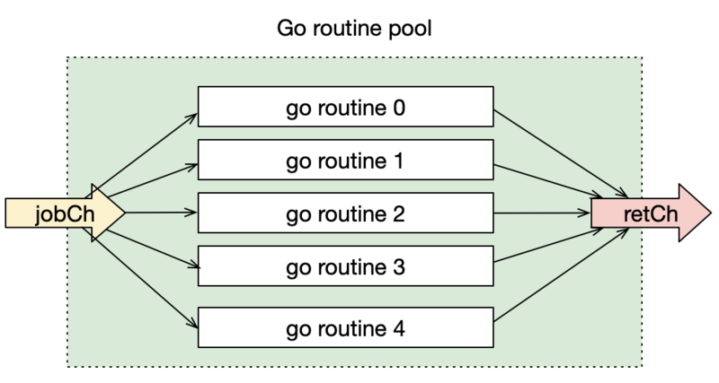
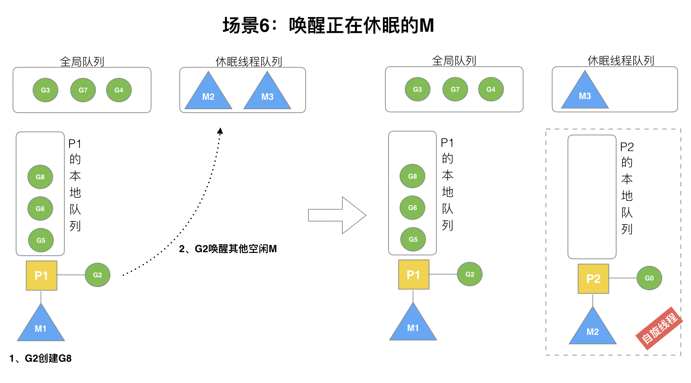
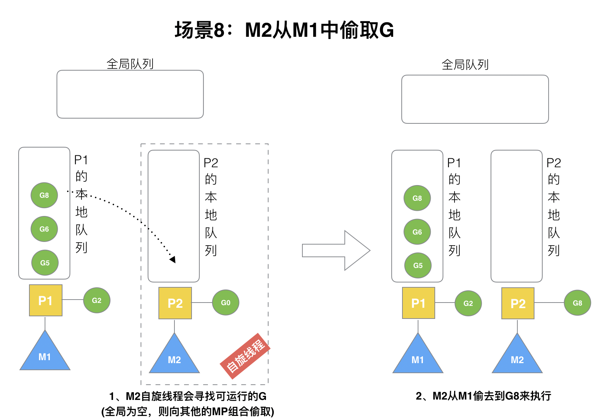
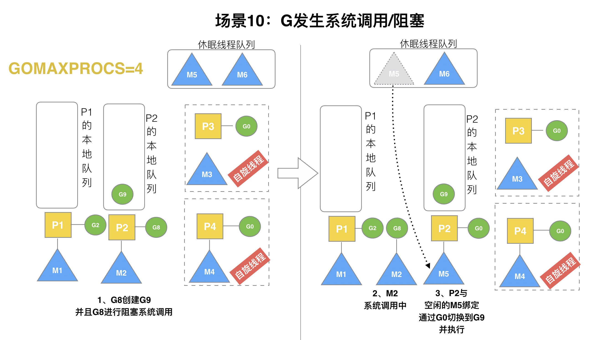

## 并发模型

### 并发和并行的区别
并发是**同时处理**多件事情，同一时间可以只做一件，而把其他任务做到一半先暂停，后续被暂停的任务再恢执行，这样来回切换达到并发处理多件事情的目的。并行是**同时做**多件事情，需要多核CPU支持。

### 什么是进程？

进程没被执行时，只是一个二进制文件。一旦被执行起来，它就从磁盘上的二进制文件，变成了计算机内存中的数据、寄存器里的值、堆栈中的指令、被打开的文件，以及各种设备的状态信息的一个集合。像这样一个程序运起来后的计算机执行环境的总和，就是进程。

### 进程、线程、协程的区别

**进程**：是系统资源分配的最小单位

**线程**：是CPU调度最小单位

**协程**：用户态轻量级线程，协程调度不需要内核参与而是由用户态程序来决定，协程对于操作系统而言是无感知的

* 进程之间是相互隔离的，各自拥有自己的内存空间，因此CPU对进程切换执行成本高
* 进程是线程的载体容器，进程内的多线程共享其内存空间，因此线程之间的通信比进程通信容易得多
* CPU在多线程之间快速切换调度执行，以此达到多线程并发执行的效果
* 虽然线程比较轻量，但是也有不小的调度开销，当线程开的太多，也会导致高CPU调度消耗
* 多个coroutine可以绑定在同一个线程之上，由协程调度器管理，因此coroutine的调度减少了线程频繁切换的调度开销(go程序默认只使用与CPU数量相等的线程数量)

> Q: 用户态的协程如何适时的主动出让CPU控制权？

> A: goroutine控制器可能切换的点：
>
> 1. io，select关键字
> 2. channel阻塞
> 3. 等待锁
> 4. 函数调用(有时)
> 5. runtime.Gosched()

> Q: 协作式调度和抢占式调度的优缺点？

> A: 协作式调度可以降低线程切换开销，提高CPU的使用率。但协作式调度不够智能的时候，会白白浪费CPU的执行能力，而抢占式调度可以规避这个问题。

> Q: Goroutine是如何调度的？

> A: 老版的Go语言只能依靠goroutine主动出让CPU控制权才能触发调度，而在后续的版本迭代中引入了抢占式调度，GPM模型

### CSP（communicating sequential processes）并发模型

> 使用通信来共享内存，而不是通过共享内存来通信

通过[goroutine](/golang/goroutine.md)和[channel](/golang/channel.md)来实现

#### 流水线FAN模型


#### 协程池



#### 合理退出并发协程

* 使用`context`
* 使用`for-range`,`range`能够感知到`channel`的关闭，当`channel`被close，range就会结束
* 使用`for-select`和`,ok`，继续读closed的`channel`，`ok`的值会是`false`, 此时置`channel`为`nil`，`select`不会在`nil`的通道上进行等待
* 使用退出通道退出。定义一个`stopCh`,发送退出信号，监听方式: `case <-stopCh`，这样只需要发送1条消息，每个worker都会收到信号，进而关闭

[参考资料](https://segmentfault.com/a/1190000017251049)

### GPM调度模型
* G — 表示 Goroutine，它是一个待执行的任务
* P — 表示处理器，它可以被看做运行在线程上的本地调度器
* M — 当前操作系统分配到当前Go程序的内核线程数，它由操作系统的调度器调度和管理

#### 调度器的设计策略

* 复用线程
    - work stealing
      
        当本线程无可运行的G时, 全局G队列也为空时，尝试从其他线程绑定的P偷取G, 而不是销毁线程。
    - hand off 
    
        当本线程的G阻塞时, 线程释放绑定的P, 把P转移给其他空闲的线程执行。
        对于分离出来的阻塞的G, 由于没有与P绑定, 休眠, 随后再加入P的本地G队列去再尝试执行。
* 利用并行

    最多有GOMAXPROCS个线程分布在多个CPU上同时执行
* 抢占

    在coroutine中要等待一个协程主动让出CPU才执行下一个协程, 在GO中, 一个Goroutine最多占用CPU 10ms, 就会被其他Goroutine抢占, 防止其他Goroutine饿死。
* 全局G队列

    当P的本地G队列为空时, 它可以从全局G队列获取G。


3者的简要关系是每个P拥有一个本地G队列(数组结构,256长度)，M必须和一个P关联才能运行P拥有的G。

Goroutine调度器和OS调度器是通过M结合起来的，每个M都代表了1个内核线程，OS调度器负责把内核线程分配到CPU的核上执行。

线程是运行goroutine的实体，调度器的功能是把可运行的goroutine分配到工作线程上。

上图中自顶向下是调度器的4个部分：

1. **全局G队列**（Global Queue）：存放等待运行的G。
2. **P的本地队列**：同全局队列类似，存放的也是等待运行的G，存的数量有限，不超过256个。新建G’时，G’优先加入到P的本地队列，如果队列满了，则会把本地队列中一半的G移动到全局队列。
3. **P列表**：所有的P都在程序启动时创建，并保存在数组中，最多有GOMAXPROCS个（GOMAXPROCS默认为：操作系统CPU核心数）。
4. **M列表**：线程想运行任务就得获取P，从P的本地队列获取G，P队列为空时，M也会尝试从全局队列**拿**一批G放到P的本地队列，或从其他P的本地队列**偷**一半放到自己P的本地队列。M运行G，G执行之后，M会从P获取下一个G，不断重复下去。

[参考资料](https://lessisbetter.site/subject/)

### GPM调度过程

#### M0

启动程序后的编号为0的主线程，**全局唯一**，负责执行初始化操作和启动第一个G，即main的goroutine，启动第一个G之后，M0的功能就和其他普通M一样了。

#### G0

**不是全局唯一**，每个M在启动时，都会先创建它对应的G0，G0本身不指向任何可执行函数，G0仅用于负责调度G。具体的调度方式见下面的场景二。

#### 以helloworld为例的简单程序的调度过程

进程刚刚启动，还没执行到main函数时，创建M0，M0创建G0，全局G队列初始化，P列表初始化。


此时，程序执行到main函数，M0创建除G0外的第一个G，即main的goroutine。


创建main G之后，M0与G0解绑，并寻找一个空闲的P与它绑定，随后把main G放入P的本地队列中（此时没有G与M0绑定）。


main G放入P的本地队列之后，其调度方式就与普通的G是一样的了，从P的本地队列取出G与M绑定，执行，若超过10ms，就放回P队列，再取出下一个G与M绑定执行，如此循环，直到main G的函数全部执行完exit或发生panic为止。


#### 场景：创建新的G

P拥有G1，M1获取P后开始运行G1，G1使用`go func()`创建了G2，为了局部性G2优先加入到P1的本地队列。


#### 场景：某个G执行完毕

G1运行完成后(函数：`goexit`)，M上运行的goroutine切换为G0，G0负责调度时协程的切换（函数：`schedule`）。从P的本地队列取G2，从G0切换到G2，并开始运行G2(函数：`execute`)。实现了线程M1的复用。


#### 场景：开辟过多的G

假设每个P的本地队列只能存4个G。G2要创建了6个G，前3个G（G3, G4, G5）已经加入p1的本地队列，p1本地队列满了。


G2在创建G7的时候，发现P1的本地队列已满，需要执行**负载均衡**(把P1中本地队列中前一半的G，还有新创建G**转移**到全局队列。这些G被转移到全局队列时，会被打乱顺序。所以G3,G4,G7被转移到全局队列。


G2创建G8时，P1的本地队列未满，所以G8会被加入到P1的本地队列（仍然是因为局部性原理）。


#### 场景：唤醒正在休眠的M

在创建G时，运行的G会尝试唤醒其他空闲的P和M组合去执行。



假定G2在创建G时，唤醒了M2，且存在空闲的P2，则此时，M2会去绑定P2，并运行M2的G0，若此时P2本地队列没有G，M2此时就是**自旋线程**（没有G但为运行状态的线程，不断寻找G）。

线程为什么设计了自旋这个状态？

因为线程的销毁和创建都需要不小的资源开销，还不如让线程进入短期的自旋状态。

#### 场景：被唤醒的M从全局G队列取G

M2尝试从全局队列(简称“GQ”)取一批G放到P2的本地队列。M2从全局队列取的G数量符合下面的公式：

```
n = min(len(GQ)/GOMAXPROCS + 1, len(GQ/2))
```

至少从全局队列取1个g，但每次不要从全局队列移动太多的g到p本地队列，给其他p留点。这是**从全局队列到P本地队列的负载均衡**。


假定我们场景中一共有4个P（GOMAXPROCS设置为4，那么我们允许最多就能用4个P来供M使用）。所以M2只从能从全局队列取1个G（即G3）移动P2本地队列，然后完成从G0到G3的切换，运行G3。

#### 场景：从其他P队列偷取G

假设G2一直在M1上运行，经过2轮后，M2已经把G7、G4从全局队列获取到了P2的本地队列并完成运行，全局队列和P2的本地队列都空了,如场景8图的左半部分。



**全局队列已经没有G，那m就要执行work stealing(偷取)：从其他有G的P哪里偷取一半G过来，放到自己的P本地队列**。P2从P1的本地队列尾部取一半的G，本例中一半则只有1个G8，放到P2的本地队列并执行。

#### 场景：G发生调用阻塞

假定当前除了M3和M4为自旋线程，还有M5和M6为空闲的线程(没有得到P的绑定，注意我们这里最多就只能够存在4个P，所以P的数量应该永远是M>=P, 大部分都是M在抢占需要运行的P)，G8创建了G9，G8进行了**阻塞的系统调用**，M2和P2立即解绑，P2会执行以下判断：如果P2本地队列有G、全局队列有G或有空闲的M，P2都会立马唤醒1个M和它绑定，否则P2则会加入到空闲P列表，等待M来获取可用的p。本场景中，P2本地队列有G9，可以和其他空闲的线程M5绑定。



#### 场景：G从阻塞状态恢复

G8创建了G9，假如G8进行了**非阻塞系统调用**。


M2和P2会解绑，但M2会记住P2，然后G8和M2进入**系统调用**状态。当G8和M2退出系统调用时，会尝试获取P2，如果无法获取，则获取空闲的P，如果依然没有，G8会被记为可运行状态，并加入到全局队列,M2因为没有P的绑定而变成休眠状态(长时间休眠等待GC回收销毁)。

### goroutine的使用注意事项

子goroutine的panic会引起整个进程crash, 所以需要在goroutine函数写上defer recover, 注意recover只在defer语句生效

