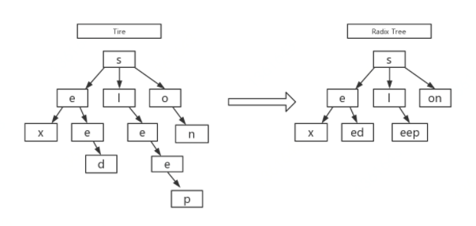

## gin

### 路由

gin框架采用了[httprouter](https://github.com/julienschmidt/httprouter进行路由匹配，httprouter 是通过基数树（radix tree）来进行高效的路径查找。

前缀树（trie），是一个多叉树，广泛应用于字符串搜索，每个树节点存储一个字符，从根节点到任意一个叶子结点串起来就是一个字符串；基数树（radix tree）是优化之后的前缀树，对空间进一步压缩，如果该节点是唯一的子树，就和父节点合并。



假设有以下路由信息：

```go
r := gin.Default()

r.GET("/", func1)
r.GET("/search/", func2)
r.GET("/support/", func3)
r.GET("/user/", func4)
r.GET("/user/:id/", func5)
r.GET("/about-us/", func6)
r.GET("/about-us/team/", func7)
r.GET("/contact/", func8)
```
那么我们会得到一个GET方法对应的路由树，具体结构如下:（路由器为每种请求方法管理一棵单独的树，还有POST、PUT、DETELE等）
```bash
Priority   Path             Handle
9          \                *<1>
3          ├s               nil
2          |├earch\         *<2>
1          |└upport\        *<3>
2          ├user\           *<4>
1          |    └:id        nil
1          |         └\     *<5>
2          ├about-us\       *<6>
1          |        └team\  *<7>
1          └contact\        *<8>
```

每个树级别上的子节点都按`Priority(优先级)`排序，其中优先级（最左列）就是在子节点(子节点、子子节点等等)中注册的句柄的数量，短路径查找速度快，这样设计可以让尽可能多的路由快速被定位。

#### 使用基数树对比于直接用map做路由有什么优势？

路由有`/user/:id`这种有参数的类型，用map就不好匹配了，因此我们需要的是根据路由模式进行匹配，而不仅仅是比较哈希值。

路由树的节点类型：

* static: 静态节点（默认），比如上面的s，earch等节点
* root: 树的根节点
* catchAll: 有*匹配的节点
* param: 参数节点

### 中间件

可以使用应用于全局的中间件，也可以使用应用于某个路由组的中间件，可以使用中间件链按序执行。

#### c.Next()

c.Next() 仅可以在中间件中使用。c.Next() 会把函数链中挂起的函数（包括中间件和controller）都执行完毕再执行其后续代码，以此可以实现中间件链的嵌套调用，而不是默认的顺序调用。

#### c.Abort()

c.Abort() 阻止未执行的挂起函数继续被调用，未执行的中间件和controller都不再执行，已执行的函数还会继续执行其后续代码。

应用场景：在鉴权中间件中判断用户无权限之后调用c.Abort()。

#### c.Set() & c.Get()

中间件和controller都能使用，在不同的中间件和controller之间可以利用这2个函数来传值。

应用场景：在中间件中根据用户传递的cookie或token来判断用户身份，然后c.Set("userId", id)好，controller就可以调用c.Get("userId")直接取出来。