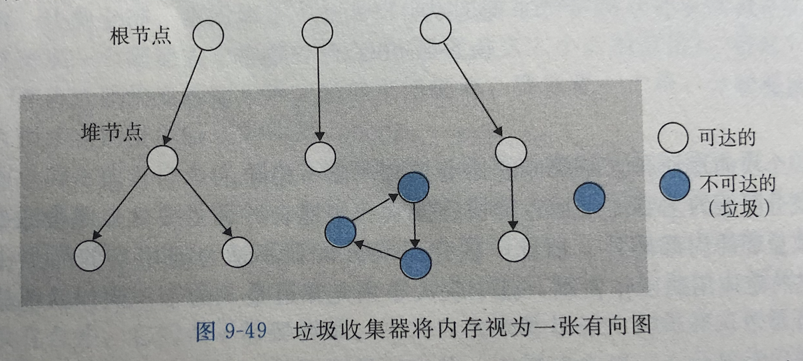
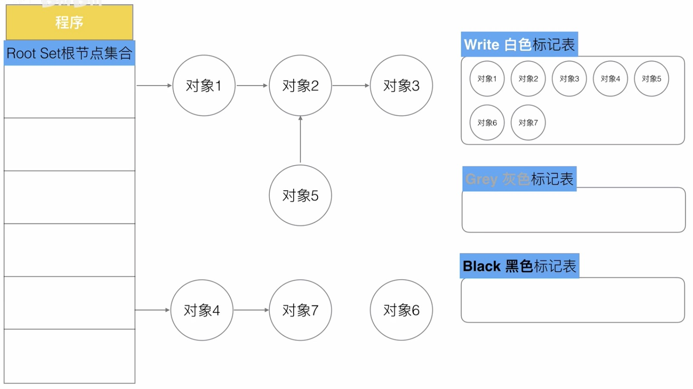
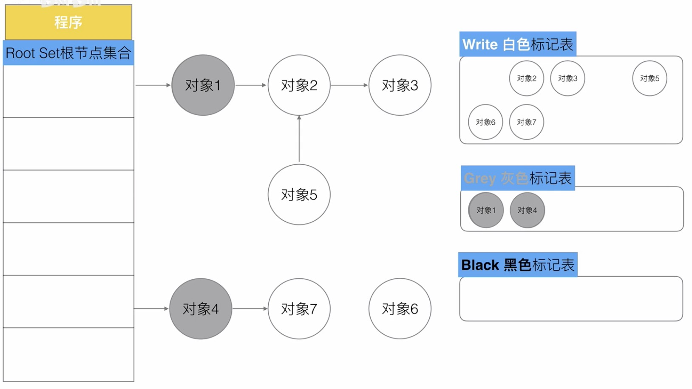
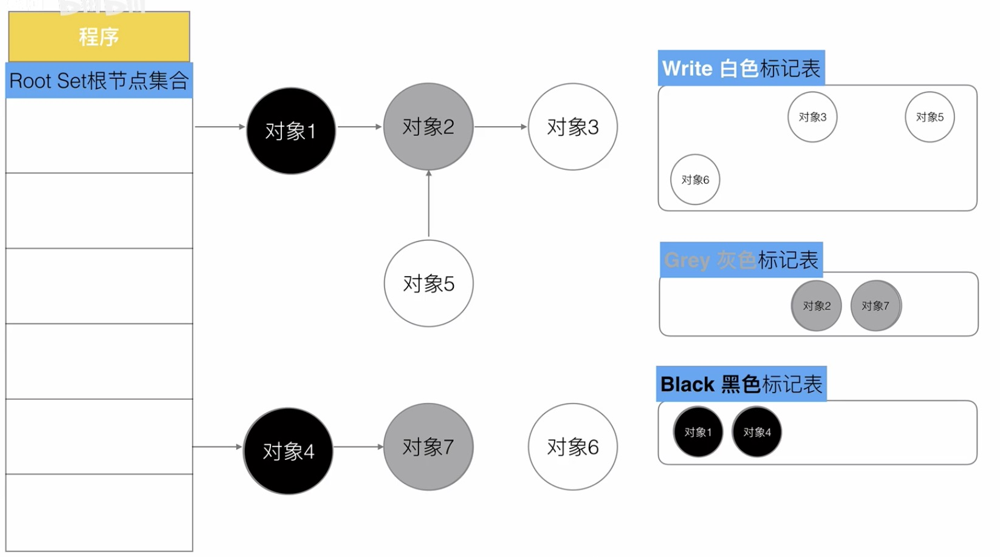
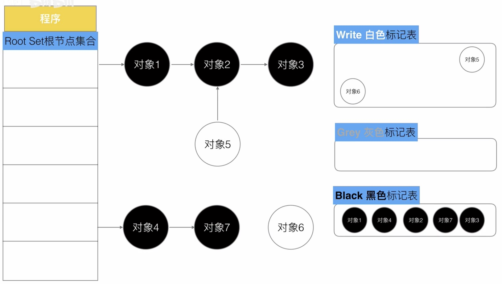
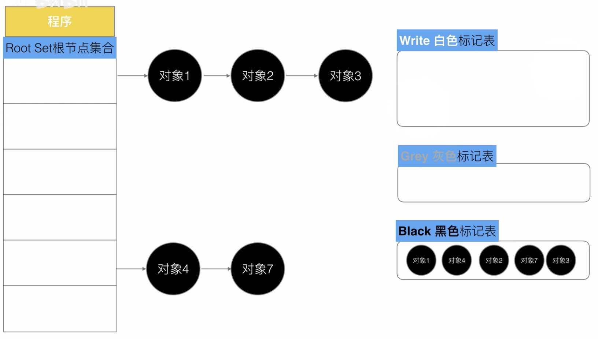
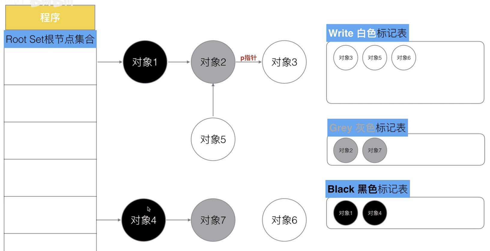
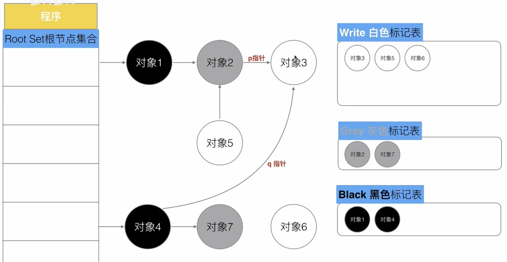
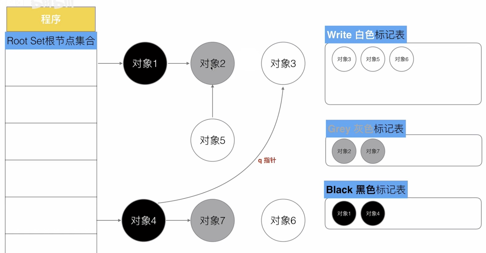
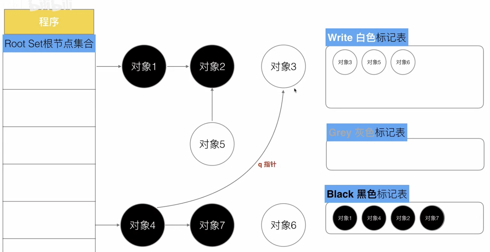

## 垃圾回收

### 基本知识

垃圾收集器将内存视为一张有向可达图，如下图节点被分为一组根节点和一组堆节点，有向边代表引用关系。不可达节点就是垃圾。

#### 什么是根节点？

每个goroutine都有它的root对象，root对象是标记扫描的源头，可以从root对象依次索引到这个goroutine使用的全部对象。

### Golang 三色标记法

#### 基本流程

有白色、灰色、黑色3个标记表，程序起初将所有对象放入白色表中

遍历根节点，标记为灰色(遍历操作只走一步，即标记出所有的根节点)

遍历灰色标记表，再走一步，将下一级的白色标记为灰色，之前的灰色标记为黑色

重复上一步，直到灰色标记表中无任何对象

收集所有白色对象(垃圾)

以上为一轮GC基本流程，下一轮又会从第一步的白色开始。

#### 三色标记法基本流程的缺点

考虑以下场景，在下图这个步骤时

对象4创建指针q，指向对象3

与此同时，对象2删除指针p

接下来，按照3色标记法，遍历灰色节点2、7

此时，灰色标记表为空，对白色对象进行垃圾回收，对象3就会被错误的回收掉。

* 一个白色对象被黑色对象引用(白色挂在黑色下)
* 灰色对象与这个白色对象之间的可达关系被删除

以上2个条件同时满足时，就会出现对象丢失现象。

解决以上问题最简单的方式就是STW(Stop The World): 暂停当前所有运行中的goroutine，由于程序是暂停的，这样的话就不会产生指针的变动。但STW太浪费资源。

#### 三色标记法的性能优化方案

由上可知，同时满足2个特殊条件时，会出现问题，那么就破坏2个条件同时成立，堆区内存的GC也就不再需要STW，GC就可与用户线程并发执行。

#### 强三色不变式

破坏条件一，强制性的不允许黑色对象引用白色对象。

**插入屏障**: 在黑色对象引用白色对象时，强制性的把白色对象变成灰色。

#### 弱三色不变式

破坏条件二，允许黑色对象引用白色，但白色对象存在其他灰色对象对它的引用, 或可达它的链路上游存在灰色对象。

**删除屏障**: 被删除对象时（被移除引用的指针），如果这个对象是白色，就把它变成灰色。

删除屏障的缺点：回收精度低，一个对象即使被删除了最后一个指向它的指针，也依旧可以活过这一轮，在下一轮GC中被清理掉。

#### 混合写屏障机制

混合写屏障只在堆区上触发，在栈区不启用。

* GC开始将栈区上的**可达对象**全部扫描并标记为黑色(之后不再进行第二次重复扫描，无需STW)
* GC期间，任何在栈上创建的新对象，均为黑色
* 被删除的对象标记为灰色
* 被添加的对象标记为灰色
