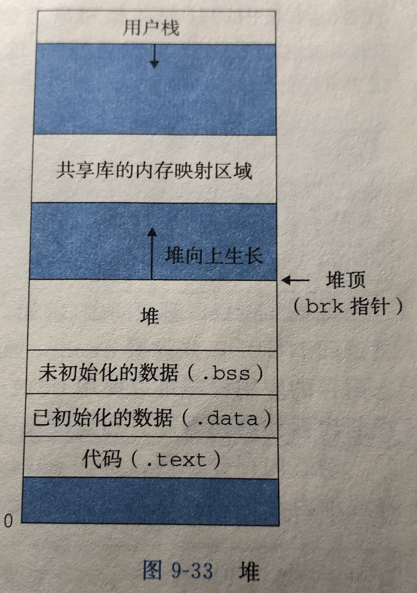

## 堆区和栈区

堆区和栈区是程序在运行时存放数据的地方。堆紧接在未初始化的数据区域后开始，并向上生长(向更高的地址)，栈向下增长。



* 栈区: 存放函数的参数值，局部变量的值等。栈的优势是，存取速度比堆要快，仅次于直接位于CPU中的寄存器。但缺点是，存在栈中的数据大小是确定的，缺乏灵活性。
* 堆区: 存放对象。堆的优势是可以动态地分配内存大小，缺点是存取速度较慢。

```c
struct test
{
        int a;
} // 这样还没在内存中开辟控件,包括任何内存都没
struct test  t1; //这个是在栈区
struct test * t2 = (struct test *)malloc(sizeof(struct test)); //堆区
```

注意: 以上是c语言，基本数据类型和指针在栈区，malloc的在堆区，C++和Java也是类似，用了new关键字就会在堆区分配内存，但是golang的机制不同，见下文。

#### 栈的数据可以共享

基本数据类型，如int、str等在栈中分配内存。

```c
int a = 3;
int b = 3;
```

编译器先处理int a= 3；首先它会在栈中创建一个变量为a的内存空间，然后查找有没有字面值为3的地址，没找到，就开辟一个存放3这个字面值的地址，然后将a指向3的地址。接着处理int b= 3；在创建完b的引用变量后，由于在栈中已经有3这个字面值，便将b直接指向3的地址。这样，就出现了a与b同时均指向3的情况。

特别注意的是，这种字面值的引用与类对象的引用不同。假定两个类对象的引用同时指向一个对象，如果一个对象引用变量修改了这个对象的内部状态，那么另一个对象引用变量也即刻反映出这个变化。相反，通过字面值的引用来修改其值，不会导致另一个指向此字面值的引用的值也跟着改变的情况。如上例，我们定义完a与b的值后，再令a=4；那么，b不会等于4，还是等于3。在编译器内部，遇到a=4；时，它就会重新搜索栈中是否有4的字面值，如果没有，重新开辟地址存放4的值；如果已经有了，则直接将a指向这个地址。因此a值的改变不会影响到b的值。[参考](https://baike.baidu.com/item/%E5%A0%86%E6%A0%88/1682032?fr=aladdin)

#### 栈指针和堆指针

应尽量避免使用栈指针

情况一: 全局指针操作已销毁的栈中变量。

```c
int* ptr;
void test(){
	int a;
	ptr=&a;
}
int main(){
  test();
  *ptr=1;
  return 0;
}
```

情况二: 返回局部变量的地址

```c
int* test(){
	int a;
	return &a;
}
int main(){
  int* ptr=test();
  *ptr=1;
  return 0;
}
```

都是在操作已经销毁的栈中变量，如果你是多线程操作，或者更极端的把这个指针又传给别的变量操作，可能会导致各种bug。[参考](https://zhuanlan.zhihu.com/p/78478567)

#### Golang特性

Golang对于变量在栈区还是堆区分配内存与上述特性有所不同，由编译器做的**逃逸分析**决定。

编译器会自动选择在栈上还是在堆上分配局部变量的存储空间，但可能令人惊讶的是，这个选择并不是由用var还是new声明变量的方式决定的。

```Go
var global *int

func f() {
    var x int
    x = 1
    global = &x
}

func g() {
    y := new(int)
    *y = 1
}
```

f函数里的x变量必须在堆上分配，因为它在函数退出后依然可以通过包一级的global变量找到，虽然它是在函数内部定义的；用Go语言的术语说，这个x局部变量从函数f中逃逸了。相反，当g函数返回时，变量`*y`将是不可达的，也就是说可以马上被回收的。因此，`*y`并没有从函数g中逃逸，编译器可以选择在栈上分配`*y`的存储空间（译注：也可以选择在堆上分配，然后由Go语言的GC回收这个变量的内存空间），虽然这里用的是new方式。其实在任何时候，你并不需为了编写正确的代码而要考虑变量的逃逸行为，要记住的是，逃逸的变量需要额外分配内存，同时对性能的优化可能会产生细微的影响。