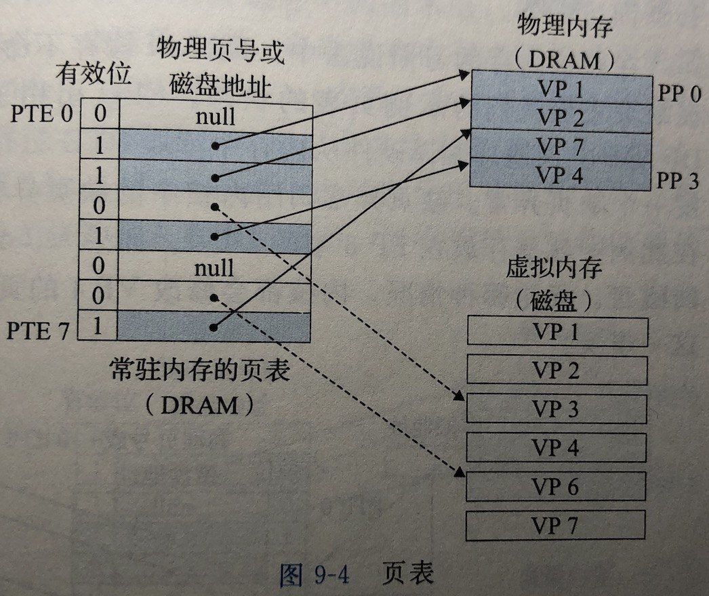
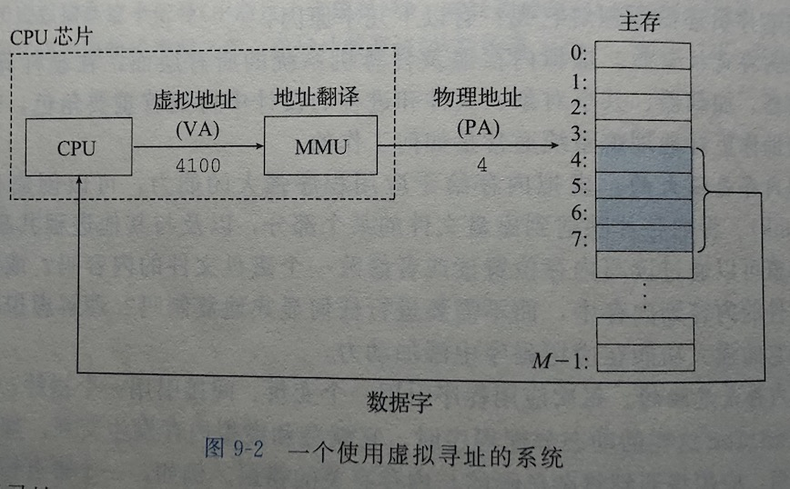
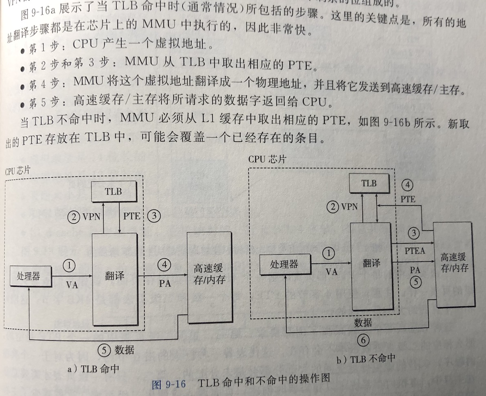

## 虚拟内存

#### 为什么需要虚拟内存?

如果直接操作物理内存，那么很容易发生占用其他进程内存的情况，甚至可能会篡改操作系统使用的内存，因此需要保护每个进程的地址空间不被其他进程破坏。

#### 虚拟内存如何为进程提供独立的地址空间？

操作系统为每个进程提供了一个独立的页表，因而也是一个独立的虚拟地址空间。

#### 什么是页表？

页表就是一个页表条目(Page Table Entry, 简称PTE)的数组，每个PTE是由一个有效位和一个n位地址字段组成的。页表将虚拟页映射到物理页。

CPU芯片上叫做**内存管理单元**(Memory Management Unit, 简称MMU)的专用硬件，利用放在主存中的页表来动态翻译虚拟地址，页表由操作系统管理。

#### 什么是TLB？

如上可知，每次CPU产生一个虚拟地址，MMU就必须查阅一个PTE，以便将虚拟地址翻译为物理地址。TLB是一个小的，虚拟寻址的缓存。

VA: 虚拟地址(Virtual Address)

PA: 物理地址(Physical Address)

VPN: 虚拟页号(Virtual Page Number)

PPN: 物理页号(Physical Page Number)

PTEA: 页表条目地址(Page Table Entry Address)

