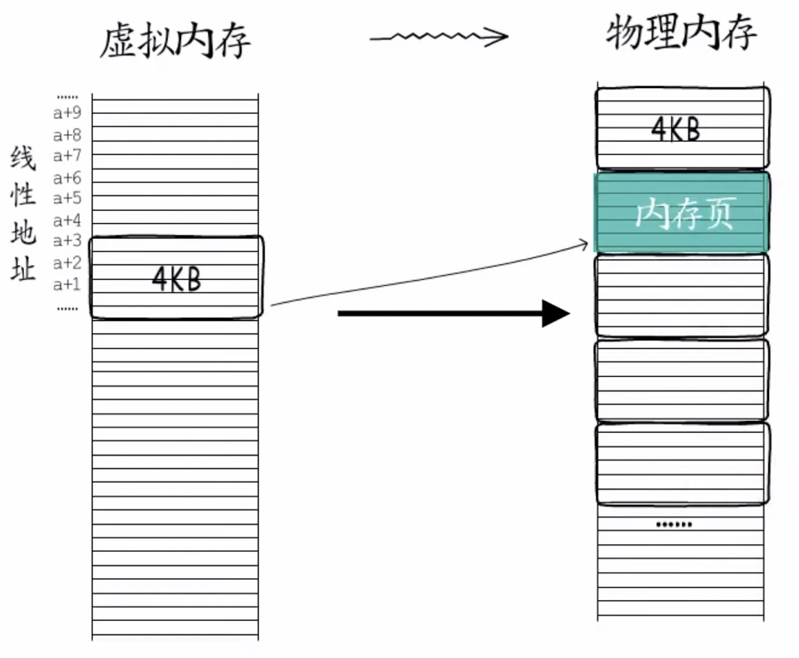
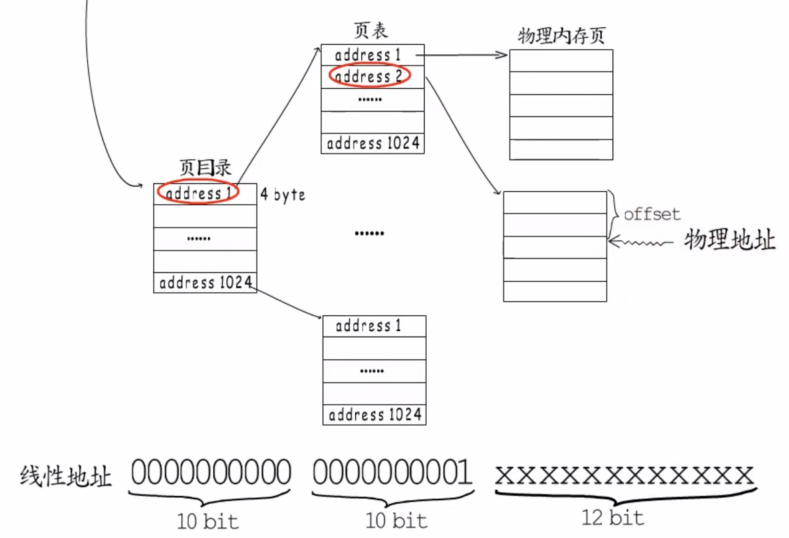
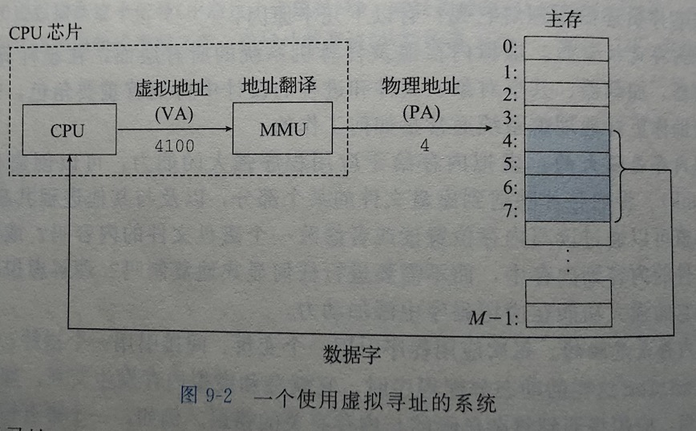
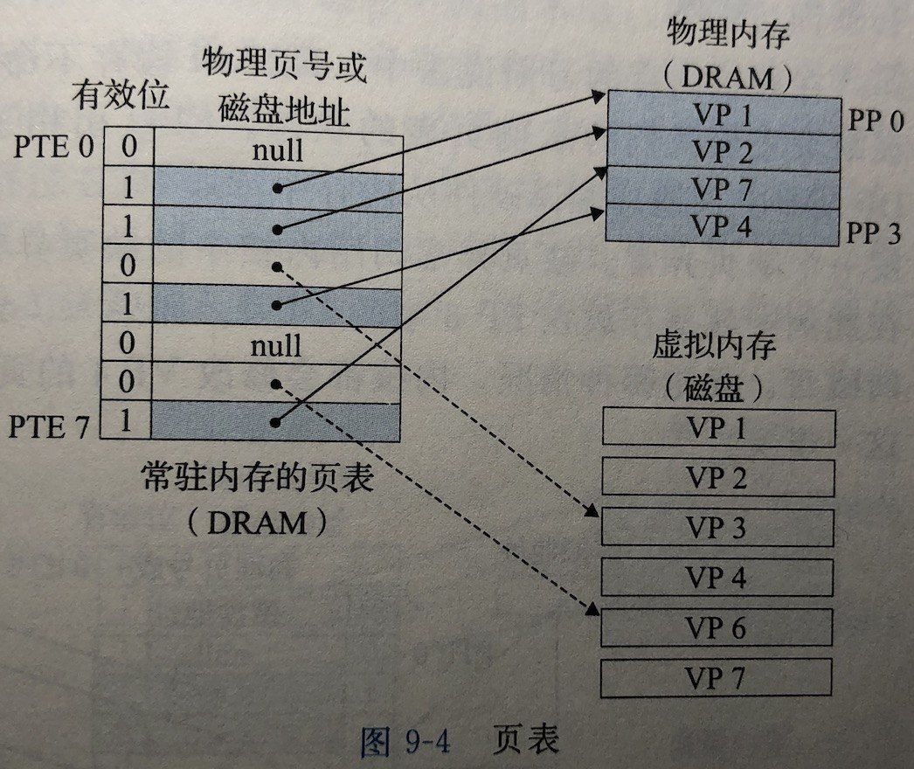
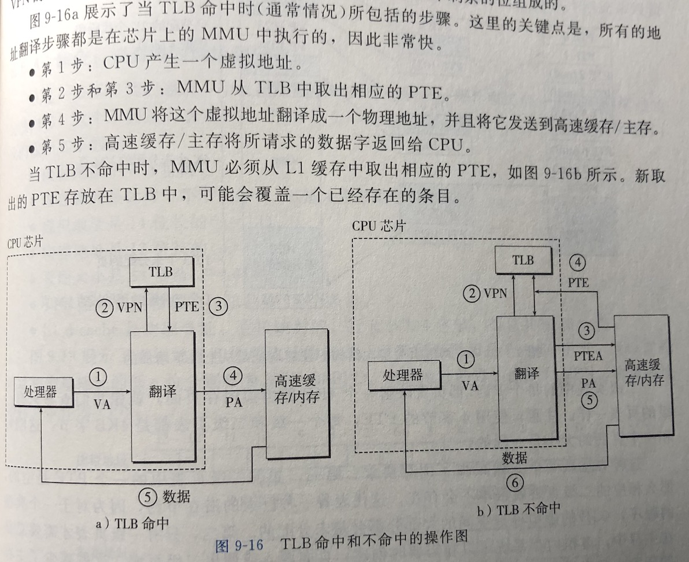

## 虚拟内存

虚拟内存是硬件异常、硬件地址翻译、主存、磁盘文件和内核软件的完美交互，它为每个进程提供了一个大的、一致的和私有的地址空间。

#### 为什么需要虚拟内存?

如果直接操作物理内存，那么很容易发生占用其他进程内存的情况，甚至可能会篡改操作系统使用的内存，因此需要保护每个进程的地址空间不被其他进程破坏。

#### 虚拟内存如何为进程提供独立的地址空间？

进程不直接使用物理地址，而是使用虚拟的内存地址，这些地址被称为线性地址（{0,1,2, ……}），操作系统负责把虚拟内存映射到物理内存。

分页机制，在32位系统下，物理内存中每4KB作为一页，从虚拟内存到物理内存是以页为单位映射的

操作系统对每个进程的控制信息都有一个"页目录"的物理地址，"页目录"也是一个内存页，存储的是一系列指针，指向下一级页表的起始地址。

在32位系统下，一个内存地址占4byte，一个页目录可以寻址1024个页表，每个页表可以寻址1024个物理内存页，1024 * 1024 * 4KB = 4G。

线性地址的前10位可以在页目录中定位到下一级的页表，接下来的10位，可以从页表中再定位到下一级的物理内存页，最后剩下的12位，用来存储相对于内存页起始地址的偏移值，12位正好覆盖4K个偏移值(2^12=4*1024), 也就足够定位到页表中的每一个地址了。

程序用到的内存区域会通过页表翻译映射到物理内存（翻译过程见下文），因此，即使是相同的线性地址(都是{0,1,2, ……}这样的虚拟地址)，也会被动态的映射到不同的物理地址，从而实现进程地址空间的隔离。还可以通过把同一组物理页面映射到不同进程的页表中，来实现进程间共享内存。

#### 来缕一遍寻址流程

既然进程使用的都是虚拟地址，那么程序执行时，CPU拿到的也是虚拟地址，CPU芯片上叫做**内存管理单元**(Memory Management Unit, 简称MMU)的专用硬件，利用放在主存中的页表来动态翻译虚拟地址，页表由操作系统管理。

#### 什么是页表？

页表就是一个页表条目(Page Table Entry, 简称PTE)的数组，每个PTE是由一个有效位和一个n位地址字段组成的。页表将虚拟页映射到物理页。

#### 什么是TLB？

如上可知，每次CPU产生一个虚拟地址，MMU就必须查阅一个PTE，以便将虚拟地址翻译为物理地址。TLB是一个小的，虚拟寻址的缓存。

VA: 虚拟地址(Virtual Address)

PA: 物理地址(Physical Address)

VPN: 虚拟页号(Virtual Page Number)

PPN: 物理页号(Physical Page Number)

PTEA: 页表条目地址(Page Table Entry Address)

