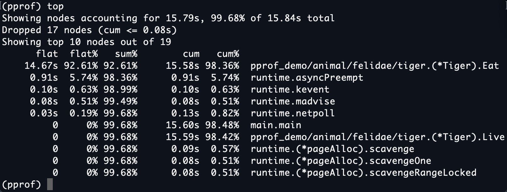
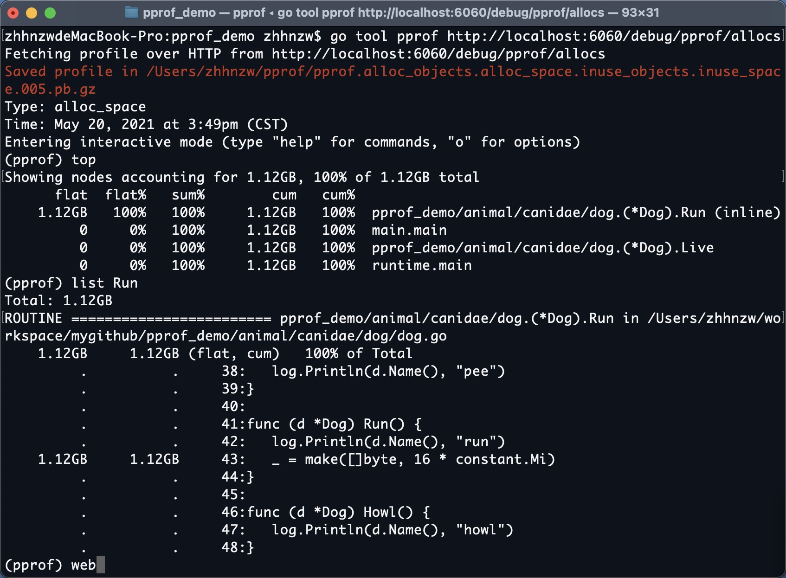
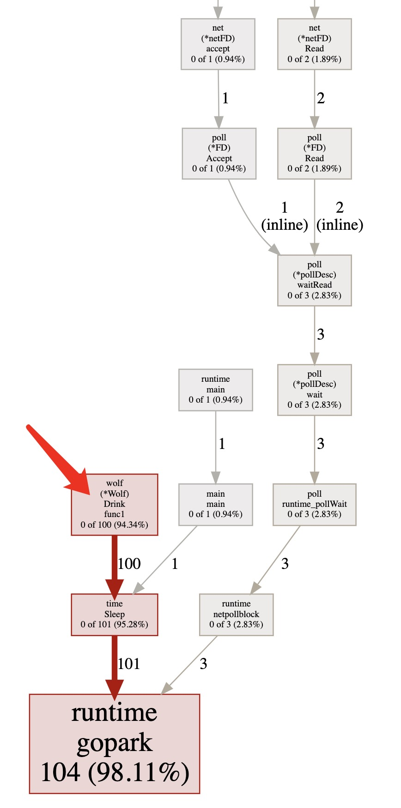

## 调优实验

对于设计好的一个“逻辑复杂”的程序，通过 pprof 来定位代码的问题。

### 实验环境准备

```bash
git clone git@github.com:zhhnzw/pprof_demo.git
cd pprof_demo
go build
./pprof_demo
```

保持程序运行，打开浏览器访问 `http://localhost:6060/debug/pprof/`


页面上展示了可用的程序运行采样数据，分别有：

| 类型         | 描述                       | 备注                                        |
| :----------- | :------------------------- | :------------------------------------------ |
| allocs       | 内存分配情况的采样信息     | 可以用浏览器打开，但可读性不高              |
| blocks       | 阻塞操作情况的采样信息     | 可以用浏览器打开，但可读性不高              |
| cmdline      | 显示程序启动命令及参数     | 可以用浏览器打开，这里会显示 `./pprof_demo` |
| goroutine    | 当前所有协程的堆栈信息     | 可以用浏览器打开，但可读性不高              |
| heap         | 堆上内存使用情况的采样信息 | 可以用浏览器打开，但可读性不高              |
| mutex        | 锁争用情况的采样信息       | 可以用浏览器打开，但可读性不高              |
| profile      | CPU 占用情况的采样信息     | 浏览器打开会下载文件                        |
| threadcreate | 系统线程创建情况的采样信息 | 可以用浏览器打开，但可读性不高              |
| trace        | 程序运行跟踪信息           | 浏览器打开会下载文件，本实验不涉及          |

由于直接阅读采样信息缺乏直观性，需要借助 `go tool pprof` 命令来排查问题，这个命令是 go 原生自带的。

### CPU 占用优化

首先通过活动监视器（或任务管理器、top 命令），查看一下 CPU 占用：


可以看到是把 CPU 的一核占满了，这显然是有问题的，使用 `go tool pprof` 来检查一下：

```bash
go tool pprof http://localhost:6060/debug/pprof/profile
```


输入 top 命令，查看 CPU 占用较高的调用：



很明显，CPU 占用过高是 `pprof_demo/animal/felidae/tiger.(*Tiger).Eat` 造成的。

输入 `list Eat`，查看问题具体在代码的哪一个位置：


可以看到，是第 24 行那个一百亿次空循环占用了大量 CPU 时间，至此，问题定位成功！

#### 扩展

在`pprof`交互式命令行输入`web`图形化显示调用栈信息。


图中，`tiger.(*Tiger).Eat` 函数的框特别大，箭头特别粗，这是`pprof`给的提示。 

至此，本小结的 CPU 优化就结束了，输入`exit`退出`pprof`交互式命令行。

为了方便进行后面的实验，来"修复"一下这个问题，注释掉相关代码即可：

```go
func (t *Tiger) Eat() {
	log.Println(t.Name(), "eat")
	//loop := 10000000000
	//for i := 0; i < loop; i++ {
	//	// do nothing
	//}
}
```

之后"修复问题"的的方法都是注释掉相关的代码，因为这只是一个研究pprof用法的实验。

### Memory占用优化

修改完代码之后，重新编译执行：

```bash
go build
./pprof_demo
```

可以看到 CPU 占用率已经下来了，但是内存的占用率仍然很高：


再次运行使用 pprof 命令，但这次使用的 URL 的结尾是 heap：

```bash
go tool pprof http://localhost:6060/debug/pprof/heap
```

再一次使用 `top`、`list` 来定问问题代码：


可以看到这次出问题的地方在 `pprof_demo/animal/muridae/mouse.(*Mouse).Steal`，函数内容如下：

```go
func (m *Mouse) Steal() {
	log.Println(m.Name(), "steal")
	max := constant.Gi
	for len(m.buffer) * constant.Mi < max {
		m.buffer = append(m.buffer, [constant.Mi]byte{})
	}
}
```

可以看到，这里有个循环会一直向 m.buffer 里追加长度为 1 MiB 的数组，直到总容量到达 1 GiB 为止，且一直不释放这些内存，这就难怪会有这么高的内存占用了。

使用 `web` 来查看图形化展示：


现在我们同样是注释掉相关代码来解决这个问题。

再次重新编译运行，查看内存占用：


可以看到内存占用已经降到了 20 MB 以内。但是，内存相关的性能问题真的已经全部解决了吗？

### 排查频繁内存回收

频繁的 GC 对 golang 程序性能的影响也是非常严重的。

为了获取程序运行过程中 GC 日志，我们需要先退出炸弹程序，再在重新启动前赋予一个环境变量，同时为了避免其他日志的干扰，使用 grep 筛选出 GC 日志查看：

```bash
GODEBUG=gctrace=1 ./pprof_demo | grep gc
```

日志输出如下：


可以看到，GC 差不多每 3 秒就发生一次，且每次 GC 都会从 16MB 清理到几乎 0MB，说明程序在不断的申请内存再释放，这是高性能 golang 程序所不允许的。

所以接下来使用 pprof 排查时，我们在乎的不是什么地方在占用大量内存，而是什么地方在不停地申请内存，这两者是有区别的。

由于内存的申请与释放频度是需要一段时间来统计的，所有我们保证炸弹程序已经运行了几分钟之后，再运行命令：

```bash
go tool pprof http://localhost:6060/debug/pprof/allocs
```

同样使用 top、list、web 大法：




可以看到 `pprof_demo/animal/canidae/dog.(*Dog).Run` 会进行无意义的内存申请，而这个函数又会被频繁调用，这才导致程序不停地进行 GC:

```go
func (d *Dog) Run() {
	log.Println(d.Name(), "run")
	_ = make([]byte, 16 * constant.Mi)
}
```

同样注释掉问题代码，重新编译执行，可以看到程序的 GC 频度要低很多了。

### 排查协程泄露

从`http://localhost:6060/debug/pprof/`可以看到，此时程序的协程数已经多达 106 个：


虽然 106 个并不算多，但对于这样一个小程序来说，似乎还是不正常的。再次是用 pprof 来排查一下：

```bash
go tool pprof http://localhost:6060/debug/pprof/goroutine
```

同样是 top、list、web 大法：


但是发现执行完`top`之后，占用大的就一个`runtime.gopark`，不明白这个是什么，用`web`来看一下：



这次问题藏得比较深，但通过`web`还是不难发现，问题在于 `pprof_demo/animal/canidae/wolf.(*Wolf).Drink` 在不停地创建没有实际作用的协程：

```go
func (w *Wolf) Drink() {
	log.Println(w.Name(), "drink")
	for i := 0; i < 10; i++ {
		go func() {
			time.Sleep(30 * time.Second)
		}()
	}
}
```

可以看到，Drink 函数每次会创建 10 个协程，每个协程会睡眠 30 秒再退出，而 Drink 函数又会被反复调用，这才导致大量协程泄露，试想一下，如果释放出的协程会永久阻塞，那么泄露的协程数便会持续增加，内存的占用也会持续增加，那程序迟早会被操作系统杀死。

接下来注释掉问题代码，重新编译运行通过`http://localhost:6060/debug/pprof/`可以看到，协程数已经降到 5 个了：


### 排查锁的争用

到目前为止，已经解决了这个程序的所有资源占用问题，但是事情还没有完，我们需要进一步排查那些会导致程序运行慢的性能问题，这些问题可能并不会导致资源占用，但会让程序效率低下，这同样是高性能程序所忌讳的。

首先想到的就是程序中是否有不合理的锁的争用，从上图可以看到，虽然协程数已经降到 5 个，但还显示有一个 mutex 存在争用问题。

```bash
go tool pprof http://localhost:6060/debug/pprof/mutex
```

同样是 top、list、web 大法：


```go
func (w *Wolf) Howl() {
	log.Println(w.Name(), "howl")
	wg := &sync.WaitGroup{}
	wg.Add(2)
	m := &sync.Mutex{}
	go func(m *sync.Mutex, wg *sync.WaitGroup) {
		defer wg.Done()
		m.Lock()
		defer m.Unlock()
		time.Sleep(time.Second)
	}(m, wg)
	go func(m *sync.Mutex, wg *sync.WaitGroup) {
		defer wg.Done()
		m.Lock()
		defer m.Unlock()
		time.Sleep(time.Second)
	}(m, wg)
	wg.Wait()
}
```

可以看到，程序里 2 个 goroutine 对同一把锁产生了争用的问题。虽然根据实际的业务需要是需要这么做的，并不一定真的是性能瓶颈，但这只是个实验，演示锁争用的情况。所以，注释掉这段问题代码，重新编译执行，继续。

### 排查阻塞操作

在程序中，除了锁的争用会导致阻塞之外，很多逻辑都会导致阻塞。通过`http://localhost:6060/debug/pprof/`可以看到，这里仍有 1 个阻塞操作


```bash
go tool pprof http://localhost:6060/debug/pprof/block
```


可以看到，阻塞操作位于 `pprof_demo/animal/felidae/cat.(*Cat).Pee`：

```go
func (c *Cat) Pee() {
	log.Println(c.Name(), "pee")

	<-time.After(time.Second)
}
```

这里是从一个 channel 里读数据时，发生了阻塞，直到这个 channel 在一秒后才有数据读出，这就导致程序阻塞了一秒而非睡眠了一秒。

注释掉问题代码，重新编译执行。至此，本项 pprof 调优实验全部完成。
