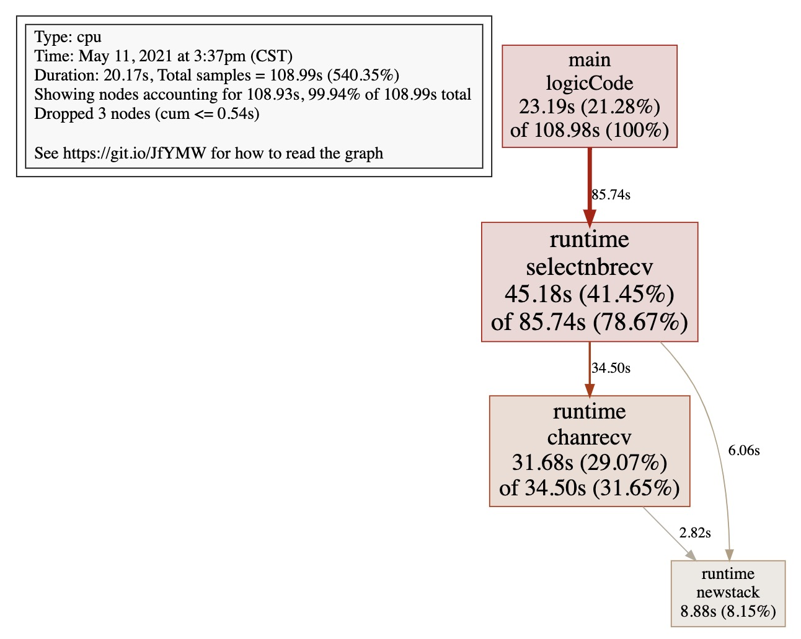
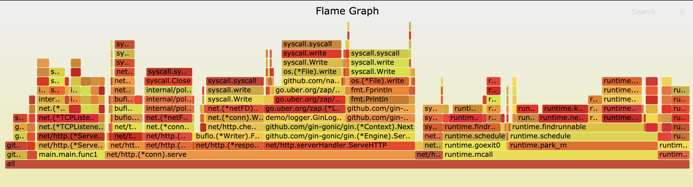
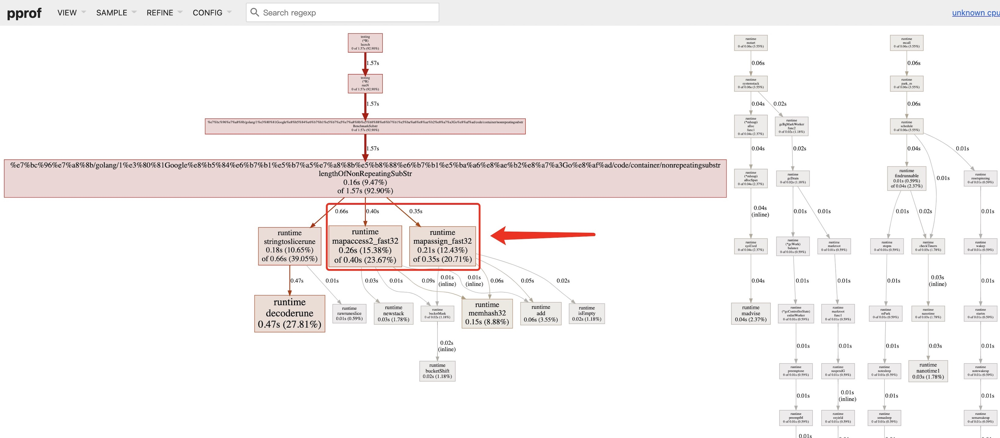
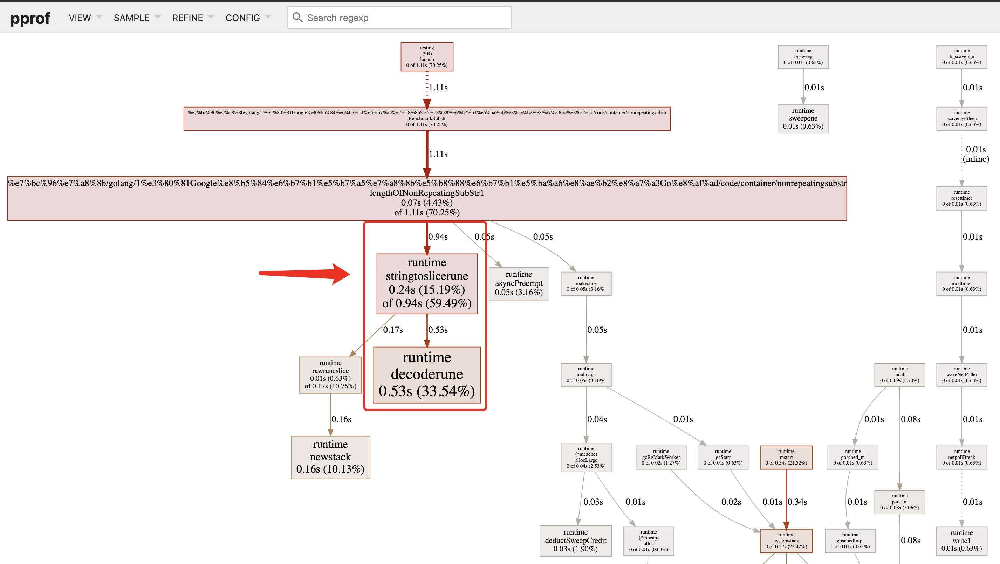

## pprof进阶使用

### 图形化工具

Mac下安装：

```bash
brew install graphviz
```

在`pprof`命令行：

```bash
(pprof) web
```



关于图形的说明： 每个框代表一个函数，理论上框的越大表示占用的CPU资源越多。 方框之间的线条代表函数之间的调用关系。 线条上的数字表示函数调用的次数。 方框中的第一行数字表示当前函数占用CPU的百分比，第二行数字表示当前函数累计占用CPU的百分比。

除了分析CPU性能数据，pprof也支持分析内存性能数据。比如，使用下面的命令分析http服务的heap性能数据，查看当前程序的内存占用以及热点内存对象使用的情况。

```bash
# 查看内存占用数据
go tool pprof -inuse_space http://127.0.0.1:8080/debug/pprof/heap
go tool pprof -inuse_objects http://127.0.0.1:8080/debug/pprof/heap
# 查看临时内存分配数据
go tool pprof -alloc_space http://127.0.0.1:8080/debug/pprof/heap
go tool pprof -alloc_objects http://127.0.0.1:8080/debug/pprof/heap
```

### 火焰图

#### 安装go-torch

uber 开源工具`go-torch`，可以直接读取 golang profiling 数据，并生成一个火焰图的 svg 文件。

```bash
go get -v github.com/uber/go-torch
```

火焰图 svg 文件可以通过浏览器打开，可以通过点击每个方块来 zoom in 检查它内部的内容。

火焰图的调用顺序从下到上，每个方块代表一个函数，它上面一层表示这个函数会调用哪些函数，方块的大小代表了占用 CPU 使用的长短。火焰图的配色并没有特殊的意义，默认的红、黄配色是为了更像火焰而已。

go-torch 工具的使用非常简单，没有任何参数的话，它会尝试从`http://localhost:8080/debug/pprof/profile`获取 profiling 数据。它有三个常用的参数可以调整：

- -u –url：要访问的 URL，这里只是主机和端口部分
- -s –suffix：pprof profile 的路径，默认为 /debug/pprof/profile
- –seconds：要执行 profiling 的时间长度，默认为 30s

#### 安装 FlameGraph

要生成火焰图，需要事先安装 FlameGraph工具，这个工具的安装很简单（需要perl环境支持），只要把对应的可执行文件加入到环境变量中即可。

1. 下载安装perl：https://www.perl.org/get.html
2. 下载FlameGraph：`git clone https://github.com/brendangregg/FlameGraph.git`
3. 将`FlameGraph`目录加入到操作系统的环境变量中。

### 压测工具wrk

https://github.com/wg/wrk 或 https://github.com/adjust/go-wrk

### 火焰图与压测工具结合使用

以服务型应用为例，[源码见](https://github.com/zhhnzw/demo)

使用wrk对version接口进行压测:

```bash
go-wrk -n 50000 http://127.0.0.1:8080/version
```

在上面压测进行的同时，打开另一个终端执行:

```bash
go-torch -u http://127.0.0.1:8080 -t 30
```

30秒之后终端会出现如下提示：

```bash
INFO[18:01:01] Run pprof command: go tool pprof -raw -seconds 30 http://127.0.0.1:8080/debug/pprof/profile
INFO[18:01:31] Writing svg to torch.svg
```

然后使用浏览器打开`torch.svg`就能看到如下火焰图了：



火焰图的y轴表示cpu调用方法的先后，x轴表示在每个采样调用时间内，方法所占的时间百分比，越宽代表占据cpu时间越多。通过火焰图我们就可以更清楚的找出耗时长的函数调用，然后不断的修正代码，重新采样，不断优化。

此外还可以借助火焰图分析内存性能数据：

```bash
go-torch -inuse_space http://127.0.0.1:8080/debug/pprof/heap
go-torch -inuse_objects http://127.0.0.1:8080/debug/pprof/heap
go-torch -alloc_space http://127.0.0.1:8080/debug/pprof/heap
go-torch -alloc_objects http://127.0.0.1:8080/debug/pprof/heap
```

### pprof与性能测试结合使用

`go test`命令有两个参数和 pprof 相关，它们分别指定生成的 CPU 和 Memory profiling 保存的文件：

- -cpuprofile：cpu profiling 数据要保存的文件地址
- -memprofile：memory profiling 数据要报文的文件地址

可以选择将pprof与性能测试相结合，比如下面执行测试的同时，也会执行 CPU profiling，并把结果保存在 cpu.prof 文件中：

```bash
go test -bench . -cpuprofile=cpu.prof
```

比如下面执行测试的同时，也会执行 Mem profiling，并把结果保存在 cpu.prof 文件中：

```bash
go test -bench . -memprofile=./mem.prof
```

### 优化案例

[以优化基准测试的lengthOfNonRepeatingSubStr函数为例](test.md)

1. 执行`go test -bench=Substr -v -cpuprofile=cpu.prof -benchmem`在性能测试的同时取得 CPU profiling 数据文件。

2. 执行`go tool pprof -http=":8081" cpu.prof`，访问`http://localhost:8081`



通过上图可以看出，大部分时间都花在了map相关操作

3. 知道了性能瓶颈所在之后，优化源代码，用`[]int`代替`map`

   ```go
   func lengthOfNonRepeatingSubStr1(s string) int {
   	lastOccurred := make([]int, 0xffff)
   	start := 0
   	maxLength := 0
   
   	for i, ch := range []rune(s) {
   		if lastI := lastOccurred[ch]; lastI > start {
   			start = lastI
   		}
   		if i-start+1 > maxLength {
   			maxLength = i - start + 1
   		}
   		lastOccurred[ch] = i + 1
   	}
   
   	return maxLength
   }
   ```

   再执行测试命令：

   ```bash
   zhhnzw$ go test -bench=Substr -v -cpuprofile=cpu.prof -benchmem
   === RUN   TestSubstr
   --- PASS: TestSubstr (0.00s)
   goos: darwin
   goarch: amd64
   cpu: Intel(R) Core(TM) i7-7920HQ CPU @ 3.10GHz
   BenchmarkSubstr
       nonrepeating_test.go:41: len(s) = 491520
       nonrepeating_test.go:41: len(s) = 491520
       nonrepeating_test.go:41: len(s) = 491520
   BenchmarkSubstr-8            601           1968375 ns/op         1179663 B/op          2 allocs/op
   PASS
   ```

   可以看到，执行效率从`5152279 ns/op`进步到了`1968375 ns/op`，内存消耗从`655590 B/op`退步到了`1179663 B/op`，再执行`go tool pprof -http=":8081" cpu.prof`，访问`http://localhost:8081`   



4. 可以看到，现在CPU性能消耗只剩下了`stringtoslicerune`，涉及到的就是`rune(s)`操作，这里是需要一个`utf-8`的解码操作耗费了CPU计算时间，因为必须要支持中文，这个解码操作是省不了的，所以CPU的优化到此就完成了。

5. 接下来再来看内存，观察到函数每次被调用每次都会创建一个`slice`，这一点可以优化，把`lastOccurred`变量提取到全局变量，在函数内每次都清掉它的值，这样这个`slice`变量就只用初始化一次了

   ```go
   var lastOccurred = make([]int, 0xffff)
   func lengthOfNonRepeatingSubStr2(s string) int {
   
   	for i,l:=0,len(lastOccurred);i<l;i++ {
   		lastOccurred[i]=0
   	}
   	start := 0
   	maxLength := 0
   
   	chs := []rune(s)
     // 这也是个优化细节，用 i<len(chs) 会每次调用 len 函数，下面这样写，len 函数只会调用一次
   	for i,l:=0,len(chs);i<l;i++ {  
   		if lastI := lastOccurred[chs[i]]; lastI > start {
   			start = lastI
   		}
   		if i-start+1 > maxLength {
   			maxLength = i - start + 1
   		}
   		lastOccurred[chs[i]] = i + 1
   	}
     
   	return maxLength
   }
   ```

   再执行测试命令：

   ```bash
   zhhnzw$ go test -bench=Substr -v -cpuprofile=cpu.prof -benchmem
   === RUN   TestSubstr
   --- PASS: TestSubstr (0.00s)
   goos: darwin
   goarch: amd64
   cpu: Intel(R) Core(TM) i7-7920HQ CPU @ 3.10GHz
   BenchmarkSubstr
       nonrepeating_test.go:41: len(s) = 491520
       nonrepeating_test.go:41: len(s) = 491520
       nonrepeating_test.go:41: len(s) = 491520
   BenchmarkSubstr-8            620           1927372 ns/op          655362 B/op          1 allocs/op
   PASS
   ```

   可以看到，内存消耗进步到了`655362 B/op`，内存分配次数从2次优化到了1次，至此CPU和Memory都优化完毕了。
