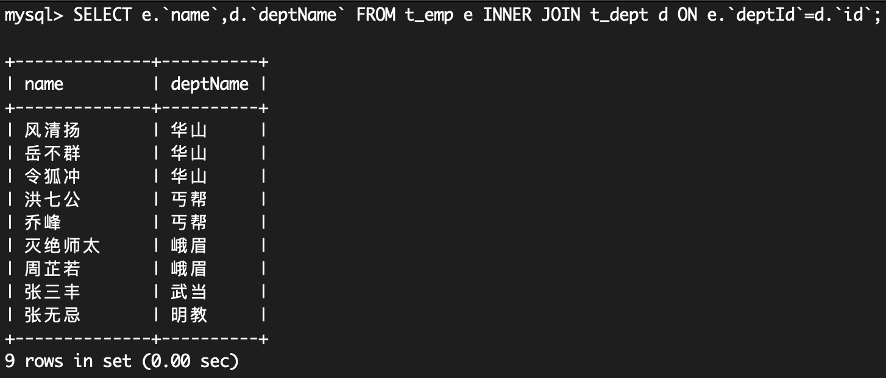
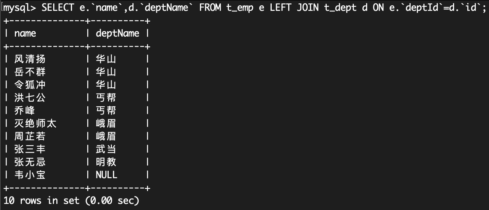
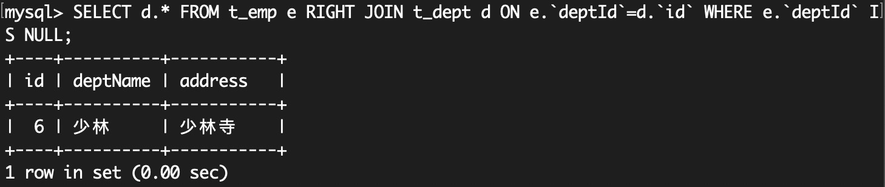
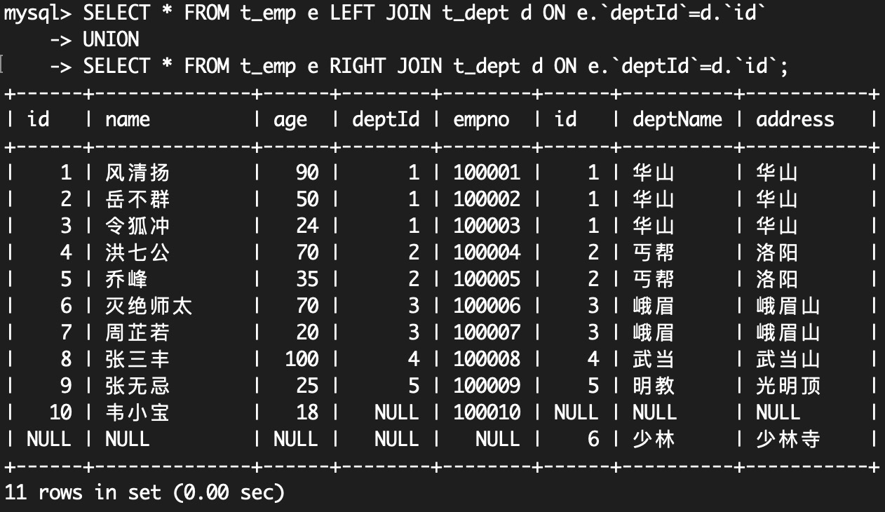
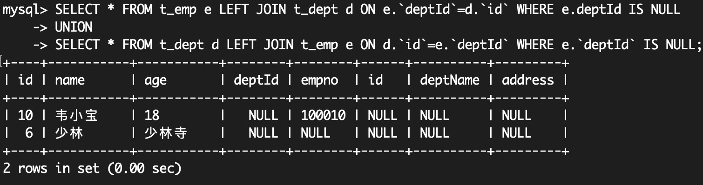

## Join


交集部分代表能关联上的记录

### 案例

#### 建表

```sql
CREATE TABLE `t_dept` ( 
  `id` INT(11) NOT NULL AUTO_INCREMENT, 
  `deptName` VARCHAR(30) DEFAULT NULL, 
  `address` VARCHAR(40) DEFAULT NULL, 
  PRIMARY KEY (`id`) 
) ENGINE=INNODB AUTO_INCREMENT=1 DEFAULT CHARSET=utf8; 
CREATE TABLE `t_emp` ( 
  `id` INT(11) NOT NULL AUTO_INCREMENT, 
  `name` VARCHAR(20) DEFAULT NULL, 
  `age` INT(3) DEFAULT NULL, 
  `deptId` INT(11) DEFAULT NULL, 
  empno INT NOT NULL, 
  PRIMARY KEY (`id`), 
  KEY `idx_dept_id` (`deptId`) 
  #CONSTRAINT `fk_dept_id` FOREIGN KEY (`deptId`) REFERENCES `t_dept` (`id`) 
) ENGINE=INNODB AUTO_INCREMENT=1 DEFAULT CHARSET=utf8; 
INSERT INTO t_dept(deptName,address) VALUES('华山','华山'); 
INSERT INTO t_dept(deptName,address) VALUES('丐帮','洛阳'); 
INSERT INTO t_dept(deptName,address) VALUES('峨眉','峨眉山'); 
INSERT INTO t_dept(deptName,address) VALUES('武当','武当山'); 
INSERT INTO t_dept(deptName,address) VALUES('明教','光明顶'); 
INSERT INTO t_dept(deptName,address) VALUES('少林','少林寺'); 
INSERT INTO t_emp(NAME,age,deptId,empno) VALUES('风清扬',90,1,100001);
INSERT INTO t_emp(NAME,age,deptId,empno) VALUES('岳不群',50,1,100002); 
INSERT INTO t_emp(NAME,age,deptId,empno) VALUES('令狐冲',24,1,100003); 
INSERT INTO t_emp(NAME,age,deptId,empno) VALUES('洪七公',70,2,100004); 
INSERT INTO t_emp(NAME,age,deptId,empno) VALUES('乔峰',35,2,100005); 
INSERT INTO t_emp(NAME,age,deptId,empno) VALUES('灭绝师太',70,3,100006); 
INSERT INTO t_emp(NAME,age,deptId,empno) VALUES('周芷若',20,3,100007); 
INSERT INTO t_emp(NAME,age,deptId,empno) VALUES('张三丰',100,4,100008); 
INSERT INTO t_emp(NAME,age,deptId,empno) VALUES('张无忌',25,5,100009); 
INSERT INTO t_emp(NAME,age,deptId,empno) VALUES('韦小宝',18,null,100010);
```

#### 所有有门派人员的信息（要求显示门派名称）

即上图中，中间情形。`INNER JOIN`的含义是：根据指定字段关联A、B表，筛选出同时存在于A、B表的数据。

```sql
SELECT e.`name`,d.`deptName` FROM t_emp e INNER JOIN t_dept d ON e.`deptId`=d.`id`;
```



#### 列出所有人员及其门派信息

即上图中，左上角情形。`LEFT JOIN`的含义是：根据指定字段关联A、B表，筛选出所有存在于A表的数据，若B表没有与之关联的数据则该字段值为null。

```sql
SELECT e.`name`,d.`deptName` FROM t_emp e LEFT JOIN t_dept d ON e.`deptId`=d.`id`;
```



#### 所有无人门派

即上图中，右中情形。`RIGHT JOIN`的含义是：根据指定字段关联A、B表，筛选出所有存在于B表的数据，若A表没有与之关联的数据则该字段值为null。

```sql
SELECT d.* FROM t_emp e RIGHT JOIN t_dept d ON e.`deptId`=d.`id` WHERE e.`deptId` IS NULL;
```

`RIGHT JOIN`筛选出来的记录除了A、B表能关联上的记录，还包括仅存在于B表的记录，此时在结果集中，对于这些仅存在于B表的记录相应A表的字段就是NULL值，因此用`WHERE A.Key IS NULL`筛选目标数据即可。



一般`RIGHT JOIN`也可以用`LEFT JOIN`查出来

```sql
SELECT d.* FROM t_dept d LEFT JOIN t_emp e ON d.`id`=e.`deptId` WHERE e.`deptId` IS NULL;
```
#### 所有人员和门派的对应关系

即上图中，左下情形。

```sql
SELECT * FROM t_emp e LEFT JOIN t_dept d ON e.`deptId`=d.`id` 
UNION 
SELECT * FROM t_emp e RIGHT JOIN t_dept d ON e.`deptId`=d.`id`;
```

由于MySQL没有`FULL OUTER JOIN`，用`UNION`组合2个查询来代替这个功能，`UNION`会自动去重其组合查询的记录



#### 所有没有入门派的人员和没人入的门派

即上图中，右下情形。

```sql
SELECT * FROM t_emp e LEFT JOIN t_dept d ON e.`deptId`=d.`id` WHERE e.deptId IS NULL 
UNION 
SELECT * FROM t_dept d LEFT JOIN t_emp e ON d.`id`=e.`deptId` WHERE e.`deptId` IS NULL;
```

