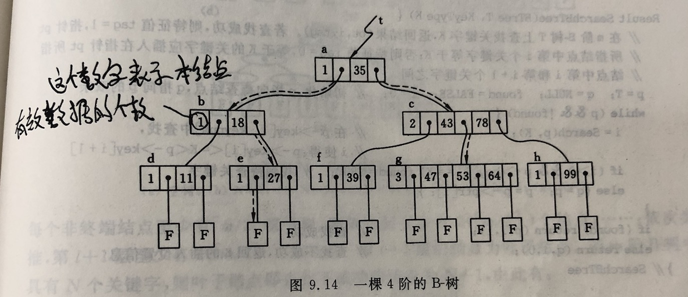

## 索引

索引（Index）是帮助MySQL高效获取数据的**数据结构**。

索引能够加快访问数据的速度，因为存储引擎不再需要进行全表扫描来获取需要的数据，取而代之的是从索引的根节点开始进行搜索。

#### 优势和劣势

* 优势：提高了数据检索的效率，降低数据库的IO成本；降低数据排序的成本，降低了CPU的消耗。
* 劣势：索引也要占用空间，会降低更新表的速度（更新表时也要更新索引）。

#### 索引的分类

* 单列索引
* 复合索引：该类索引包含多个列。
* 唯一索引：该类索引列的值必须唯一，但允许有空值。

#### 索引的数据结构类型

* B-Tree索引
* 哈希索引
* 空间数据索引
* 全文索引

#### B-Tree索引

通过B-Tree的查找方式，可以快速定位到查找的叶子节点(或者不存在)。而叶子节点的指针指向了被索引的数据。

假设定义了这样的索引: key(last_name, first_name, birthday)，有效的查找方式：

* 全值匹配
* 匹配最左前缀。如：上述索引只根据 last_name 查找，即只使用第一列
* 匹配列前缀。如：上述索引只查找所有以J开头的 last_name。也只用到了第一列
* 匹配范围值。如：查找 last_name 范围在 Allen 和 Barry 之间的人。也只用到了第一列
* 精确匹配某一列并范围匹配另外一列。第一列全匹配，第二列范围匹配
* 只访问索引的查询。即**索引覆盖**(Covering Index)。

关于B-Tree索引的限制：

* 如果不是按照索引的最左列开始查找，则无法使用索引。
* 不能跳过索引中的列。如：上述索引下查找姓为Smith并且在某个特定日期出生的人，如果不指定名(first_name)，则MySQL只能使用索引的第一列。
* 不能使用索引中范围查找条件右边的列，例如`WHERE name='Smith' AND age > 22 AND position='manager'`, 这个查询只能使用索引的前两列。
* MySQL在使用不等于（`!=`或者`<>`）的时候无法使用索引会导致全表扫描。
* `is null`或`is not null`查询语句也无法使用索引。
* `LIKE`的通配符放在左边（比如`'%abc'`）也无法使用索引（%放右边可以），若业务场景中左边的%就是要写上，可利用**索引覆盖**来避免全表扫描。
* 在索引列上做的计算（如`WHERE id-1=9 `）、函数调用、自动或手动的类型转换，会导致索引失效而转向全表扫描。对于`VARCHAR`类型的字段，查询时若不加单引号（比如 `WHERE name=2000`），索引会失效，因为MySQL会自动对这个int类型做类型转换换成string。

注：在优化查询性能的时候，可能需要使用相同的列但顺序不同的索引来满足不同类型的查询需求。

#### 索引覆盖

查询的数据列只从索引中就能够取得，不必回表读取数据行。-> 索引叶子节点存储了它们索引的数据 。

#### 哪些情况不要建索引？

* 表记录太少
* 经常增删改的表（频繁增删改表数据时，MySQL底层还要额外更新索引文件，反而降低了效率）
* 数据重复率高且分布平均的字段（通过索引要能筛选掉绝大部分不需要的数据）

### 索引为什么选用B+树来实现？

1. B+树的磁盘读写代价更低：B+树的非叶子节点没有数据指针，占用空间小，用更少的磁盘空间就可以容纳，这样就减少了IO读写次数。

2. B+树的查询效率更加稳定：由于B+树的数据指针都存在叶子节点上，所以从根结点到叶子结点的查询路径长度相同，导致每一个数据的查询效率相当。

3. B+树可以做到对数值区间范围内的快速查找。

   B+树最下层的叶子节点是串起来的双向链表，而且是有序的。

   B+树上有两个头指针，一个指向根节点，另一个指向关键字最小的叶子节点。

   因此，B+树支持两种查找运算：一种是按叶子节点的链表顺序查找，另一种是从根节点开始进行随机查找。

   那么在做区间范围的查找时，定位到范围查找的起始节点之后，就可以顺着链表把需要的数据都查出来。

### 聚簇索引和非聚簇索引的区别？

**聚簇索引**的叶子节点就是数据节点，而**非聚簇索引**的叶子节点仍然是索引节点，只不过有指向对应数据块的指针。

**聚簇索引的顺序就是数据的物理存储顺序，而非聚簇索引与数据物理排列顺序无关。**

使用聚簇索引查找数据几乎总是比使用非聚簇索引快，因为一旦具有第一个索引值的记录被找到，具有连续索引值的记录也一定物理地紧跟其后。一张表只能有一个聚簇索引，所以非常珍贵，必须慎重设置，一般要根据这个表最常用的SQL查询方式选择某个（或多个）字段作为聚簇索引（或复合聚簇索引）。

聚簇索引默认是主键，如果表中没有定义主键，InnoDB会选择一个**唯一的非空索引**代替（“唯一的非空索引”是指列不能出现null值的唯一索引，跟主键性质一样）。如果没有这样的索引，InnoDB会隐式地定义一个主键来作为聚簇索引。