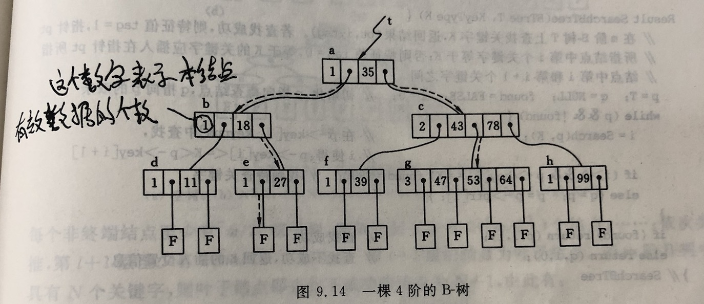
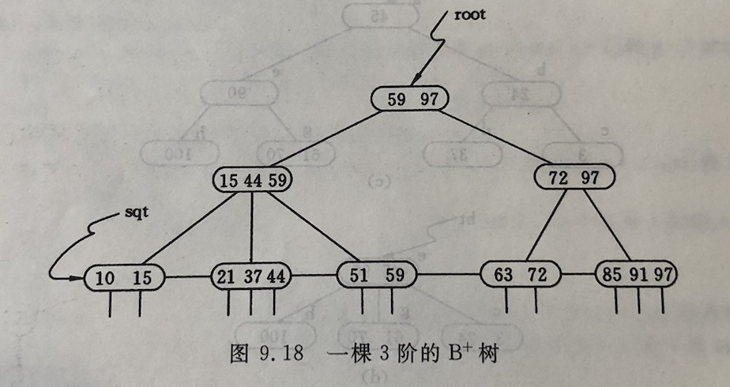

## 索引原理

### 索引为什么选用B+树来实现？

1. B+树的磁盘读写代价更低：B+树的非叶子节点没有数据指针，占用空间小，用更少的磁盘空间就可以容纳，这样就减少了IO读写次数。

2. B+树的查询效率更加稳定：由于B+树的数据指针都存在叶子节点上，所以从根结点到叶子结点的查询路径长度相同，导致每一个数据的查询效率相当。

3. B+树可以做到对数值区间范围内的快速查找。

   B+树最下层的叶子节点是串起来的双向链表，而且是有序的。

   B+树上有两个头指针，一个指向根节点，另一个指向关键字最小的叶子节点。

   因此，B+树支持两种查找运算：一种是按叶子节点的链表顺序查找，另一种是从根节点开始进行随机查找。

   那么在做区间范围的查找时，定位到范围查找的起始节点之后，就可以顺着链表把需要的数据都查出来。

### 聚簇索引和非聚簇索引的区别？

**聚簇索引**的叶子节点就是数据节点，而**非聚簇索引**的叶子节点仍然是索引节点，只不过有指向对应数据块的指针。

**聚簇索引的顺序就是数据的物理存储顺序，而非聚簇索引与数据物理排列顺序无关。**

使用聚簇索引查找数据几乎总是比使用非聚簇索引快，因为一旦具有第一个索引值的记录被找到，具有连续索引值的记录也一定物理地紧跟其后。一张表只能有一个聚簇索引，所以非常珍贵，必须慎重设置，一般要根据这个表最常用的SQL查询方式选择某个（或多个）字段作为聚簇索引（或复合聚簇索引）。

聚簇索引默认是主键，如果表中没有定义主键，InnoDB会选择一个**唯一的非空索引**代替（“唯一的非空索引”是指列不能出现null值的唯一索引，跟主键性质一样）。如果没有这样的索引，InnoDB会隐式地定义一个主键来作为聚簇索引。