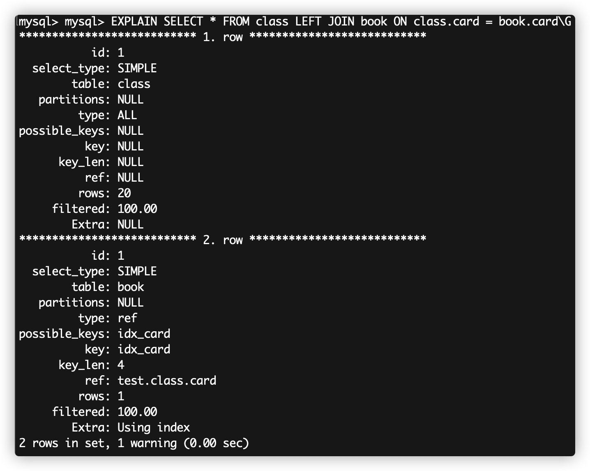
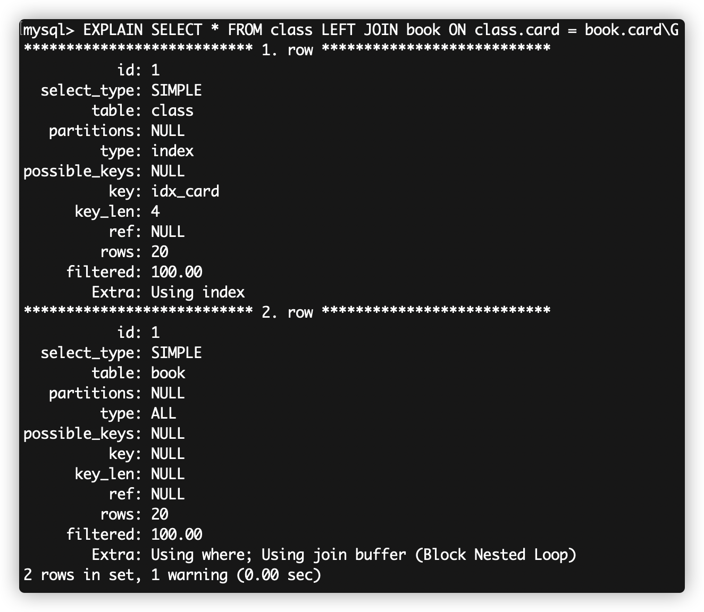
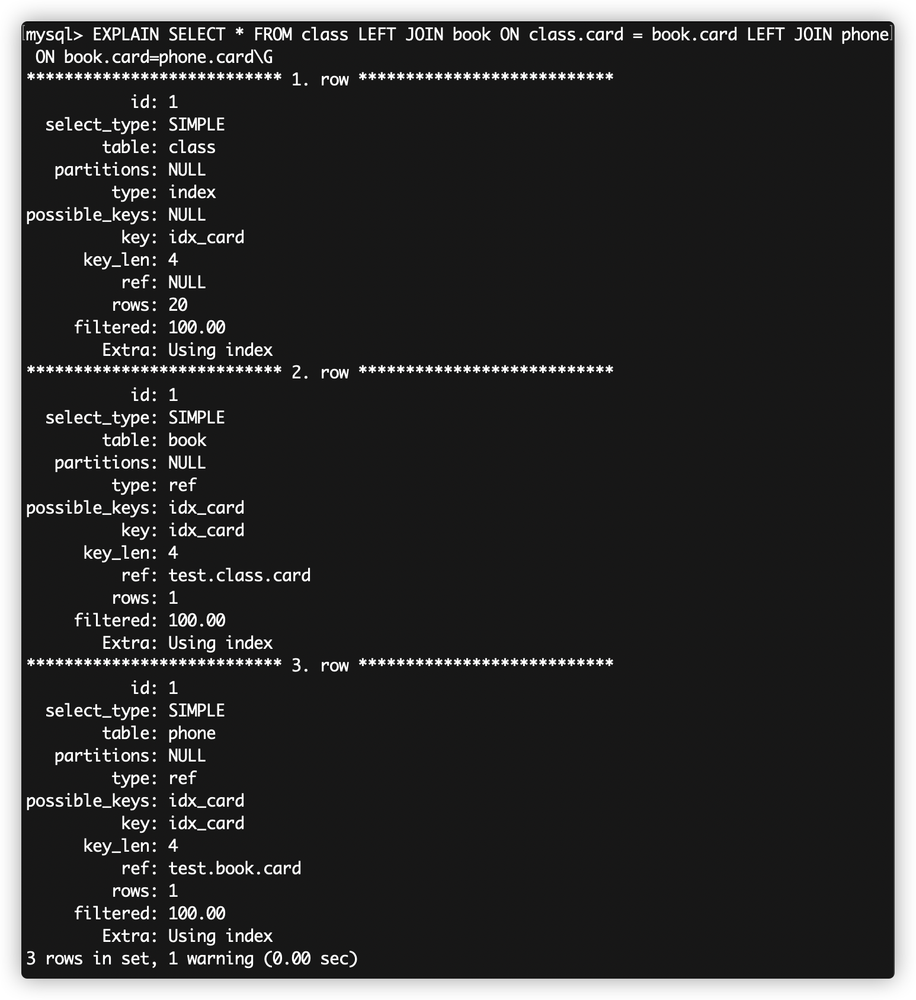

## 查询优化

### 索引

索引（Index）是帮助MySQL高效获取数据的**数据结构**。

索引能够加快访问数据的速度，因为存储引擎不再需要进行全表扫描来获取需要的数据，取而代之的是从索引的根节点开始进行搜索。

#### 优势和劣势

* 优势：提高了数据检索的效率，降低数据库的IO成本；降低数据排序的成本，降低了CPU的消耗。
* 劣势：索引也要占用空间，会降低更新表的速度（更新表时也要更新索引）。

#### 索引的分类

* 单列索引
* 复合索引：该类索引包含多个列。
* 唯一索引：该类索引列的值必须唯一，但允许有空值。

#### 索引的数据结构类型

* B-Tree索引
* 哈希索引
* 空间数据索引
* 全文索引

#### B-Tree索引

通过B-Tree的查找方式，可以快速定位到查找的叶子节点(或者不存在)。而叶子节点的指针指向了被索引的数据。

假设定义了这样的索引: key(last_name, first_name, birthday)，有效的查找方式：

* 全值匹配
* 匹配最左前缀。如：上述索引只根据 last_name 查找，即只使用第一列
* 匹配列前缀。如：上述索引只查找所有以J开头的 last_name。也只用到了第一列
* 匹配范围值。如：查找 last_name 范围在 Allen 和 Barry 之间的人。也只用到了第一列
* 精确匹配某一列并范围匹配另外一列。第一列全匹配，第二列范围匹配
* 只访问索引的查询。即**索引覆盖**(Covering Index)。

关于B-Tree索引的限制：

* 如果不是按照索引的最左列开始查找，则无法使用索引。
* 不能跳过索引中的列。如：上述索引下查找姓为Smith并且在某个特定日期出生的人，如果不指定名(first_name)，则MySQL只能使用索引的第一列。
* 不能使用索引中范围查找条件右边的列，例如`WHERE name='Smith' AND age > 22 AND position='manager'`, 这个查询只能使用索引的前两列。
* MySQL在使用不等于（`!=`或者`<>`）的时候无法使用索引会导致全表扫描。
* `is null`或`is not null`查询语句也无法使用索引。
* `LIKE`的通配符放在左边（比如`'%abc'`）也无法使用索引（%放右边可以），若业务场景中左边的%就是要写上，可利用**索引覆盖**来避免全表扫描。
* 在索引列上做的计算（如`WHERE id-1=9 `）、函数调用、自动或手动的类型转换，会导致索引失效而转向全表扫描。对于`VARCHAR`类型的字段，查询时若不加单引号（比如 `WHERE name=2000`），索引会失效，因为MySQL会自动对这个int类型做类型转换换成string。

注：在优化查询性能的时候，可能需要使用相同的列但顺序不同的索引来满足不同类型的查询需求。

#### 索引覆盖

查询的数据列只从索引中就能够取得，不必回表读取数据行。-> 索引叶子节点存储了它们索引的数据 。

#### 哪些情况不要建索引？

* 表记录太少
* 经常增删改的表（频繁增删改表数据时，MySQL底层还要额外更新索引文件，反而降低了效率）
* 数据重复率高且分布平均的字段（通过索引要能筛选掉绝大部分不需要的数据）

### 性能分析

#### Explain

使用`EXPLAIN`关键字可以模拟优化器执行SQL查询语句，从而知道MySQL是如何处理SQL语句的。

| 列名          | 说明                                                         |
| ------------- | ------------------------------------------------------------ |
| id            | 执行编号，结合table字段可看出表的读取顺序。<br>如果有子查询，id的序号会递增，id值越大，越先被执行；对于id值相同的，顺序执行。 |
| select_type   | 显示本行是简单或复杂select。<br>如果查询有任何复杂的子查询，则最外层标记为PRIMARY（DERIVED、UNION、UNION RESUlT） |
| table         | 表示访问的是哪个表。                                         |
| type          | 数据读取操作类型。<br>从最好到最差：system > const > eq_ref > ref > range > index > ALL<br>eq_ref：对于每个索引键，表中只有一条记录与之匹配，常见于主键或唯一索引扫描。<br>ref：非唯一索引扫描，返回多条记录。<br>range：也可应用索引（key列显示具体使用了哪个索引），where语句中出现了between、<、>、in等范围扫描。<br>index：Full Index Scan，与`ALL`的区别是`index`类型遍历的是索引树，索引文件比数据文件小。<br>ALL：全表扫描。 |
| possible_keys | 表示推测可能用到的索引，列出来的索引不一定被实际使用。       |
| key           | 表示实际使用的索引，如果为`NULL`，则没有使用索引。           |
| key_len       | 表示在索引里使用的字节数（最大可能长度，并非实际使用长度）。<br>在不损失精确性的情况下，长度越短越好。 |
| ref           | 显示了之前的表在key列记录的索引中查找值所用的列或常量。      |
| rows          | 为了找到所需的行而需要读取的行数，估算值，不精确。通过把所有rows列值相乘，可粗略估算整个查询会检查的行数。 |
| Extra         | 非常重要的额外信息，如：<br>Using filesort：无法利用索引完成的排序操作称之为**文件排序**（数据量大时，效率低）<br>Using temporay：在对查询结果排序时使用了临时表（效率很低）。常见于排序 order by 和分组查询 group by。<br/>Using index：表示相应的 select 操作中使用了**覆盖索引**，避免访问了表的数据行（效率高）。 |

### 查询优化

#### 两表关联优化案例

##### 建表

```sql
CREATE TABLE IF NOT EXISTS `class` ( 
  `id` INT(10) UNSIGNED NOT NULL AUTO_INCREMENT, 
  `card` INT(10) UNSIGNED NOT NULL COMMENT '一个 card 代表一个类别', 
  PRIMARY KEY (`id`) 
)ENGINE=INNODB COMMENT '商品类别'; 
CREATE TABLE IF NOT EXISTS `book` (
  `bookid` INT(10) UNSIGNED NOT NULL AUTO_INCREMENT, 
  `card` INT(10) UNSIGNED NOT NULL COMMENT '用 card 关联，代表这本书的类别', 
  PRIMARY KEY (`bookid`) 
)ENGINE=INNODB;
INSERT INTO class(card) VALUES(FLOOR(1 + (RAND() * 20))); 
INSERT INTO class(card) VALUES(FLOOR(1 + (RAND() * 20))); 
INSERT INTO class(card) VALUES(FLOOR(1 + (RAND() * 20))); 
INSERT INTO class(card) VALUES(FLOOR(1 + (RAND() * 20))); 
INSERT INTO class(card) VALUES(FLOOR(1 + (RAND() * 20))); 
INSERT INTO class(card) VALUES(FLOOR(1 + (RAND() * 20))); 
INSERT INTO class(card) VALUES(FLOOR(1 + (RAND() * 20))); 
INSERT INTO class(card) VALUES(FLOOR(1 + (RAND() * 20))); 
INSERT INTO class(card) VALUES(FLOOR(1 + (RAND() * 20))); 
INSERT INTO class(card) VALUES(FLOOR(1 + (RAND() * 20))); 
INSERT INTO class(card) VALUES(FLOOR(1 + (RAND() * 20))); 
INSERT INTO class(card) VALUES(FLOOR(1 + (RAND() * 20))); 
INSERT INTO class(card) VALUES(FLOOR(1 + (RAND() * 20))); 
INSERT INTO class(card) VALUES(FLOOR(1 + (RAND() * 20))); 
INSERT INTO class(card) VALUES(FLOOR(1 + (RAND() * 20))); 
INSERT INTO class(card) VALUES(FLOOR(1 + (RAND() * 20))); 
INSERT INTO class(card) VALUES(FLOOR(1 + (RAND() * 20))); 
INSERT INTO class(card) VALUES(FLOOR(1 + (RAND() * 20))); 
INSERT INTO class(card) VALUES(FLOOR(1 + (RAND() * 20))); 
INSERT INTO class(card) VALUES(FLOOR(1 + (RAND() * 20)));
INSERT INTO book(card) VALUES(FLOOR(1 + (RAND() * 20)));
INSERT INTO book(card) VALUES(FLOOR(1 + (RAND() * 20))); 
INSERT INTO book(card) VALUES(FLOOR(1 + (RAND() * 20))); 
INSERT INTO book(card) VALUES(FLOOR(1 + (RAND() * 20))); 
INSERT INTO book(card) VALUES(FLOOR(1 + (RAND() * 20))); 
INSERT INTO book(card) VALUES(FLOOR(1 + (RAND() * 20))); 
INSERT INTO book(card) VALUES(FLOOR(1 + (RAND() * 20))); 
INSERT INTO book(card) VALUES(FLOOR(1 + (RAND() * 20))); 
INSERT INTO book(card) VALUES(FLOOR(1 + (RAND() * 20))); 
INSERT INTO book(card) VALUES(FLOOR(1 + (RAND() * 20))); 
INSERT INTO book(card) VALUES(FLOOR(1 + (RAND() * 20))); 
INSERT INTO book(card) VALUES(FLOOR(1 + (RAND() * 20))); 
INSERT INTO book(card) VALUES(FLOOR(1 + (RAND() * 20))); 
INSERT INTO book(card) VALUES(FLOOR(1 + (RAND() * 20))); 
INSERT INTO book(card) VALUES(FLOOR(1 + (RAND() * 20))); 
INSERT INTO book(card) VALUES(FLOOR(1 + (RAND() * 20))); 
INSERT INTO book(card) VALUES(FLOOR(1 + (RAND() * 20))); 
INSERT INTO book(card) VALUES(FLOOR(1 + (RAND() * 20))); 
INSERT INTO book(card) VALUES(FLOOR(1 + (RAND() * 20))); 
INSERT INTO book(card) VALUES(FLOOR(1 + (RAND() * 20)));                                          
```

##### 分析

```sql
EXPLAIN SELECT * FROM class LEFT JOIN book ON class.card = book.card;
# 给以上查询语句的右表添加索引
ALTER TABLE book ADD INDEX idx_card(`card`);
```


```sql
# 删除 book 表的索引：
DROP INDEX idx_card ON book; 
# 给左表添加索引
ALTER TABLE class ADD INDEX idx_card(`card`);
```



对比可知，索引加在右表时，Extra列为 `Using index`，即**索引覆盖**，优于把索引加在左表的情况。

分析： `LEFT JOIN`  时，在查找结果集中，左表的记录是一定都有的，从右边查找相应的行与之关联，因此有效的优化方式是：给右表添加索引。

注：`RIGHT JOIN` 原理类似，且`LEFT JOIN` 和`RIGHT JOIN` 在互换左右表时即为等价的作用，因此通常可考虑调换SQL语句的左右表，而不用修改已建立的索引。

注: `INNER JOIN`时，索引在左、右表随便存在一个就可以，MySQL会自行选择。

#### 三表关联优化案例

##### 建表

基于上例的两表，再加一个表

```sql
CREATE TABLE IF NOT EXISTS `phone` (
  `phoneid` INT(10) UNSIGNED NOT NULL AUTO_INCREMENT, 
  `card` INT(10) UNSIGNED NOT NULL COMMENT '用 card 关联，代表这部手机的类别', 
  PRIMARY KEY (`phoneid`) 
)ENGINE=INNODB;
INSERT INTO phone(card) VALUES(FLOOR(1 + (RAND() * 20)));
INSERT INTO phone(card) VALUES(FLOOR(1 + (RAND() * 20)));
INSERT INTO phone(card) VALUES(FLOOR(1 + (RAND() * 20)));
INSERT INTO phone(card) VALUES(FLOOR(1 + (RAND() * 20)));
INSERT INTO phone(card) VALUES(FLOOR(1 + (RAND() * 20)));
INSERT INTO phone(card) VALUES(FLOOR(1 + (RAND() * 20)));
INSERT INTO phone(card) VALUES(FLOOR(1 + (RAND() * 20)));
INSERT INTO phone(card) VALUES(FLOOR(1 + (RAND() * 20)));
INSERT INTO phone(card) VALUES(FLOOR(1 + (RAND() * 20)));
INSERT INTO phone(card) VALUES(FLOOR(1 + (RAND() * 20)));
INSERT INTO phone(card) VALUES(FLOOR(1 + (RAND() * 20)));
INSERT INTO phone(card) VALUES(FLOOR(1 + (RAND() * 20)));
INSERT INTO phone(card) VALUES(FLOOR(1 + (RAND() * 20)));
INSERT INTO phone(card) VALUES(FLOOR(1 + (RAND() * 20)));
INSERT INTO phone(card) VALUES(FLOOR(1 + (RAND() * 20)));
INSERT INTO phone(card) VALUES(FLOOR(1 + (RAND() * 20)));
INSERT INTO phone(card) VALUES(FLOOR(1 + (RAND() * 20)));
INSERT INTO phone(card) VALUES(FLOOR(1 + (RAND() * 20)));
INSERT INTO phone(card) VALUES(FLOOR(1 + (RAND() * 20)));
INSERT INTO phone(card) VALUES(FLOOR(1 + (RAND() * 20)));
```
##### 优化
```sql
EXPLAIN SELECT * FROM class LEFT JOIN book ON class.card = book.card LEFT JOIN phone ON book.card=phone.card;
# 建立索引
ALTER TABLE book ADD INDEX idx_card(`card`);
ALTER TABLE phone ADD INDEX idx_card(`card`);
```



由上可知，有2个`type`列是`ref`，相应的`Extra`列是`Using index`，即**索引覆盖**，效率高。

结论：多表关联时，分而治之，逐个优化即可。

#### 范围查询

假设 index(a,b,c)

`WHERE a=3 AND b > 'k' AND c=4`，由最左前缀原则可知，索引的 a，b两列生效，c列在范围查找之后，**c列不生效**。

`WHERE a=3 AND b LIKE '%kk' AND c=4`，通配符在左边，b列失效。

`WHERE a=3 AND b LIKE 'kk%' AND c=4`，通配符在右边，**b列生效，c列也生效**。

`Like '%kk'`和比较运算符`>`的区别：这两者的`EXPLAIN`的`type`列分别是`ref`和`range`，`ref`之后的索引列仍然可生效，而`range`之后的索引列不再生效。

#### 排序（ORDER BY）

假设 index(a,b,c)

`ORDER BY`能使用索引的情况：

* `ORDER BY a DESC, b DESC, c DESC`
* `WHERE a = const ORDER BY b,c`
* `WHERE a = const AND b = const ORDER BY c`
* `WHERE a = const AND b > const ORDER BY b,c`

`ORDER BY`不能使用索引，`EXPLAIN`的`type`列会出现`Using filesort`的情况：

* `ORDER BY a ASC, b DESC, c DESC`，有的升序有的降序。
* `WHERE d = const ORDER BY b,c`，最左前缀原则，丢失了最左边的a索引。
* `WHERE a = const ORDER BY c`，最左前缀原则，不能跳过索引中的列。
* `WHERE a = const AND b > const ORDER BY c`，b列是范围查询，因此b列右侧的c列索引不再生效。

### 慢查询语句

它用来记录在MySQL中响应时间超过阀值的语句。

MySQL 数据库默认没有开启慢查询日志，如果不是调优需要的话，也不建议启动该参数。

#### 操作步骤

1. 连接MySQL客户端，`SHOW VARIBLES LIKE '%slow_query_log%';`查询慢查询日志是否开启。
2. `set global sow_query_log=1;`开启慢查询日志。
3. `SHOW VARIABLES LIKE 'long_query_time%';`查看慢查询设定的阈值，单位秒。
4. `set long_query_time=3`设定慢查询阈值，单位秒。
5. 查看慢查询日志文件。