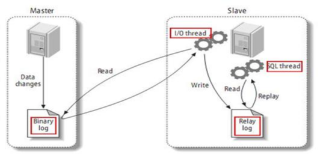

## 主从复制

MySQL  复制过程分成三步： 

1. master 将改变记录到二进制日志（binary log）。这些记录过程叫做二进制日志事件，binary log events； 
2. slave 将  master 的  binary log events  拷贝到它的中继日志（relay log）； 
3. slave 重做中继日志中的事件，将改变应用到自己的数据库中。    MySQL  复制是异步的且串行化的 。

### 复制的最大问题

因为发生多次  IO，存在延时问题

### 一主一从的配置示例

#### 主机配置

修改`[mysqld]`下的参数：

`server-id=1` # 主服务器唯一ID

`log-bin=/example/mysqlbin` # 启用二进制日志

`log-err=/example/mysqlerr` # 启用错误日志

`read-only=0` # 主机读写都可以

#### 从机配置

修改`[mysqld]`下的参数：

`server-id=2`

#### 关闭防火墙

#### 在主机上建立账户给从机授权

`GRANT REPLICATION SLAVE ON *.* TO '备份账号'@'从机器数据库IP' IDENTIFIED BY '123456';`

`flush privileges;`

`show master status;`

#### 在从机上配置需要复制的主机

`CHANGE MASTER TO MASTER_HOST='主机  IP',MASTER_USER='创建用户名',MASTER_PASSWORD='创建的密码', MASTER_LOG_FILE='File 名字',MASTER_LOG_POS=Position  数字;`（根据上一步填入参数）

`start slave;`

`show slave status\G`

若下面这2个参数都是`Yes`，则说明主从配置成功：

`Slave_IO_Running: Yes 
Slave_SQL_Running: Yes`