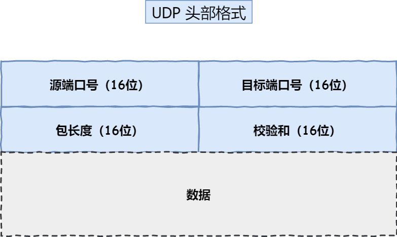
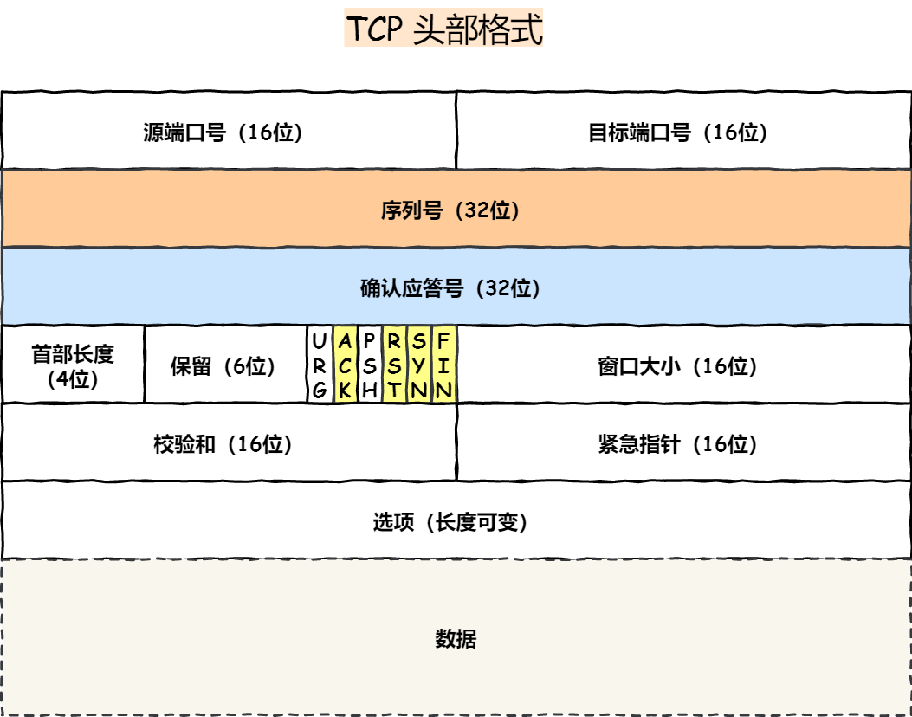
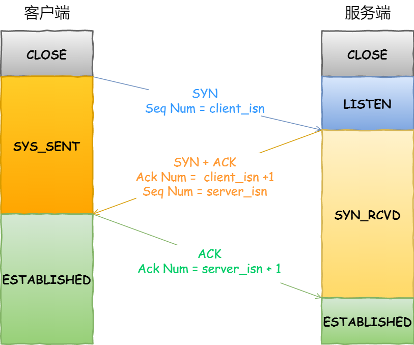

## TCP

### TCP/IP 协议 和 socket 有什么区别

socket 是 TCP/IP 协议的一种具体实现，并提供了编程操作接口。

socket也提供了对应于无连接的UDP编程操作接口。

### 三次握手四次挥手

#### UDP 报文

#### TCP 报文

#### 三次握手

#### 四次挥手

[参考资料](https://mp.weixin.qq.com/s/tH8RFmjrveOmgLvk9hmrkw)